# 以小事，敬初心 | 强力新材上市11周年微故事投票开启

> **作者**: 强力新材 | **发布时间**: 2026年3月24日 08:19

---

**时光流转，步履铿锵**

今年是强力新材上市的第十一个年头，十一年的深耕与坚守，藏在每一位强力人平凡却闪光的日常里。

为定格这份温暖与力量，我们发起了「一件小事」微故事征集，收到了来自总部职能、事业部、研究院及各子公司共33位同事的真挚投稿。那些藏在工位间的互助、项目里的坚守、生活中的善意，都化作了一段段动人的文字，诉说着强力人同心同行的初心。

今天，我们将这33篇微故事悉数呈现，并正式开启公众号投票通道。大家可以细细品读每一份热忱，为触动你的故事投出宝贵一票，同时，我们也准备了丰厚好礼，致谢每一份参与与热爱：

**📋 投票规则**

- 投票方式：请为你心中最触动的那篇故事投出宝贵的2票（共两组，每组各一票）。
- 截止时间： 2026年3月26日 12:00（中午）
- 评选机制： 最终将根据投票票数从高到低进行排名，获得相应奖品。
- 奖品发放： 获奖名单确认后，人才发展中心将主动联系获奖同事，对接奖品领取事宜。

**一等奖（1名）：皇冠20寸拉杆箱**

**二等奖（4名）：MINEX长绒棉印花床单四件套**

**三等奖（6名）：Berkshire Life自然凉感夏被**

**幸运奖（22名）：十月稻田20斤东北大米**

**📖 品读每一段故事，文末为心动的故事投出宝贵一票！**

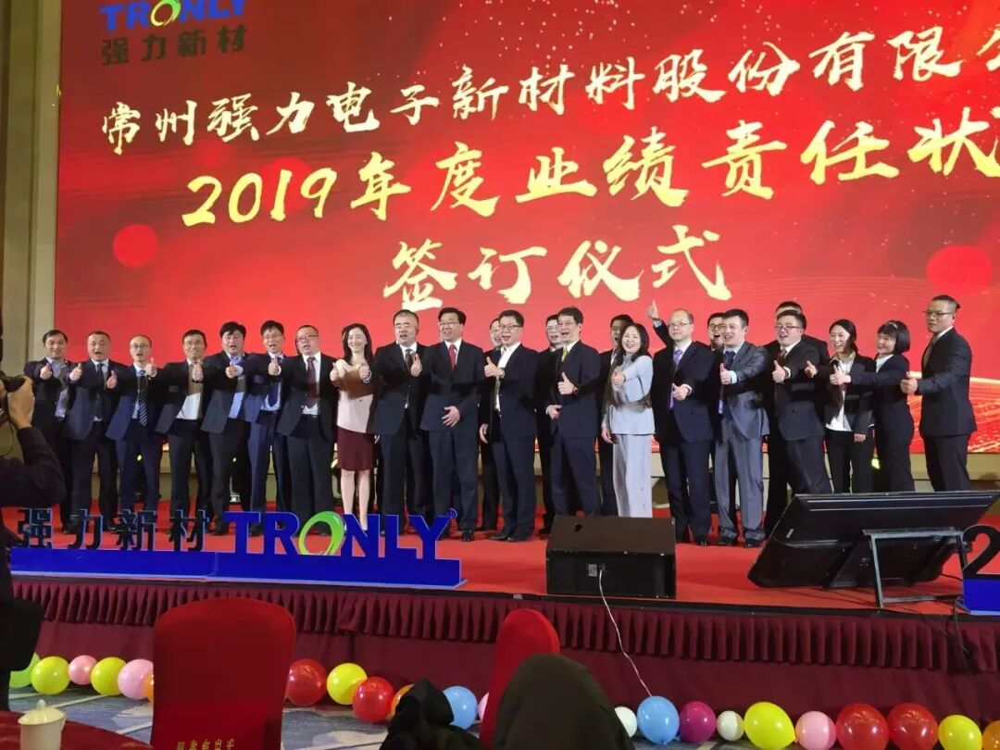
董事长办公室张卯

**张卯**

**初心如磐，使命传承**

2018年的年会舞台上，红色背景板映照着一张张坚定的脸庞，我们迎来了公司发展史上意义非凡的时刻 —— 首次签订年度业绩目标责任状。

高管团队与各分子公司核心骨干并肩而立，在 “强力新材” 的标识前郑重落笔，将2019年的目标与承诺镌刻在责任状上。这是公司第一次以责任状的形式，把发展使命层层传递，既是对过往成绩的肯定，更是对未来征程的期许。

从那一天起，这份沉甸甸的契约精神便融入了强力人的血脉，成为每年不变的仪式。如今回望，这一纸责任状早已化作推动公司稳健前行的力量，在上市的新起点上，继续指引我们向着更广阔的未来奋进。

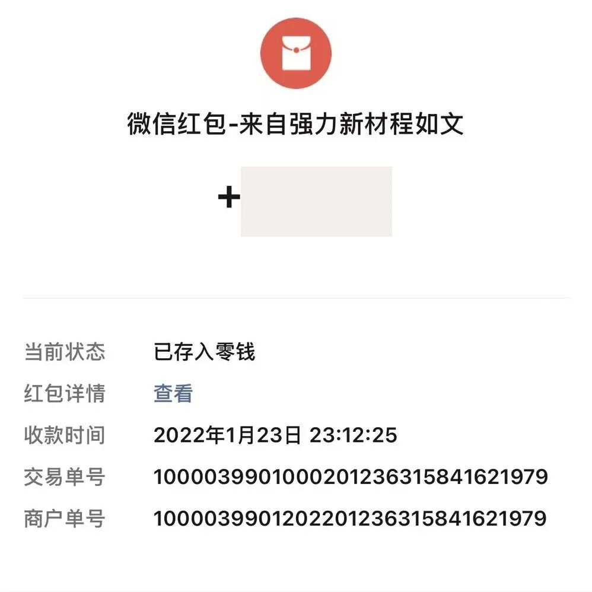
供应链管理部杨正尧

**杨正尧**

**小小红包，浓浓温情**

2021年的公司年度总结大会，那时我刚入职强力3个月，首次参加公司年会，印象最深刻的抽奖环节，除已经安排的奖项外，各位领导豪掷千金增加中奖名额。中奖率一度逼近80%，但是当天的我“幸运”的落选。当时的部门经理程如文程总在当晚抽奖活动结束后就给我发了一个红包。如今在强力已经四年半了，我对此事异常清晰。我家在贵州，虽然离家远，但是大家的心却很近！

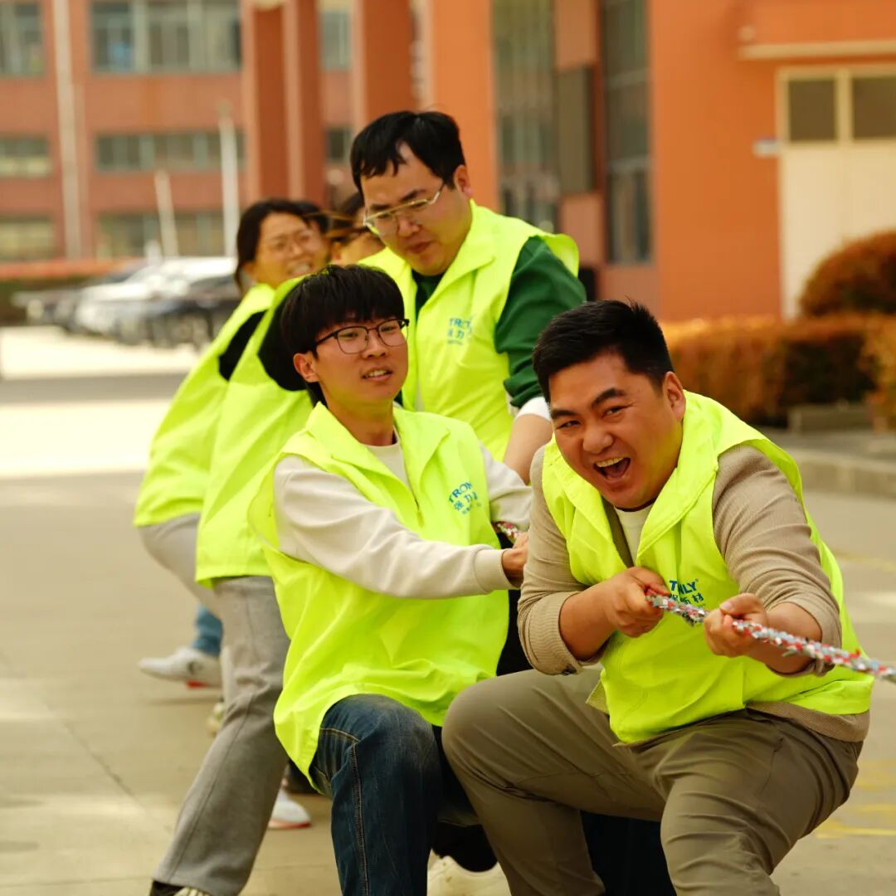
供应链管理部刘铮

**刘铮**

**比赛第一，友谊第二**

公司十周年拔河比赛，我紧紧攥着粗糙的麻绳，和同事们一同发力、呐喊。那一刻，我忽然想起自己在供应链岗位上的点点滴滴。

刚入职时，我对系统操作、供应商管理都很生疏，常常担心因自己的疏忽影响整体进度。随着公司不断发展，业务规模扩大，我也在慢慢成长，从担心拖后腿到成为团队里可靠的一环。

供应链的工作不显眼，却像拔河时的后援力量，稳得住、跟得上，才能让前方无后顾之忧。这根绳子连着团队，也连着我与公司共同走过的岁月。我在岗位上成长，公司在发展中壮大，这份并肩前行的记忆，珍贵而难忘。

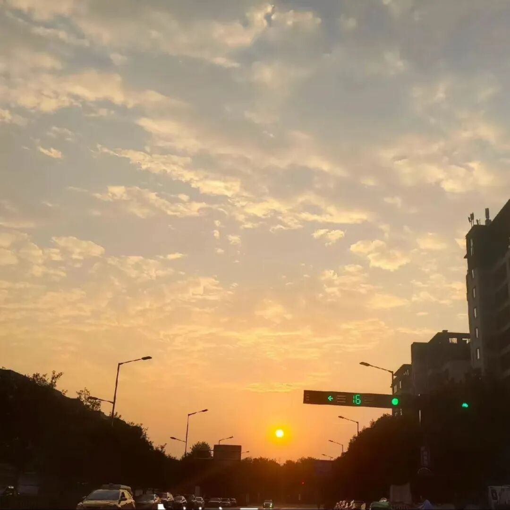
供应链管理部李柏璋

**李柏璋**

**我在路上，公**
**司在路上**

那年刚去光电上班，便开始了每天往返两小时的通勤。起初满心抗拒——天亮前上路，路灯拉着长长的影子；夜色四合时才归，抬头总能撞见稀疏的星光。

直到那个冬日清晨，一束晨光恰好穿透车窗，忽然想起公司刚开始也不过是行业新星，如今业务已遍布全国。而我，也从手忙脚乱的职场新人，渐渐长成能从容应对的模样。

每天这两小时，从焦躁变成独处时光——听听新闻，复盘工作，规划节奏。路变长了，心却更静了。

通勤还在继续，但我不再只想着“快点到”。我在路上沉淀，公司也在路上前行。

或许每一个披星戴月的日子，都在见证着我们共同的时间坐标。

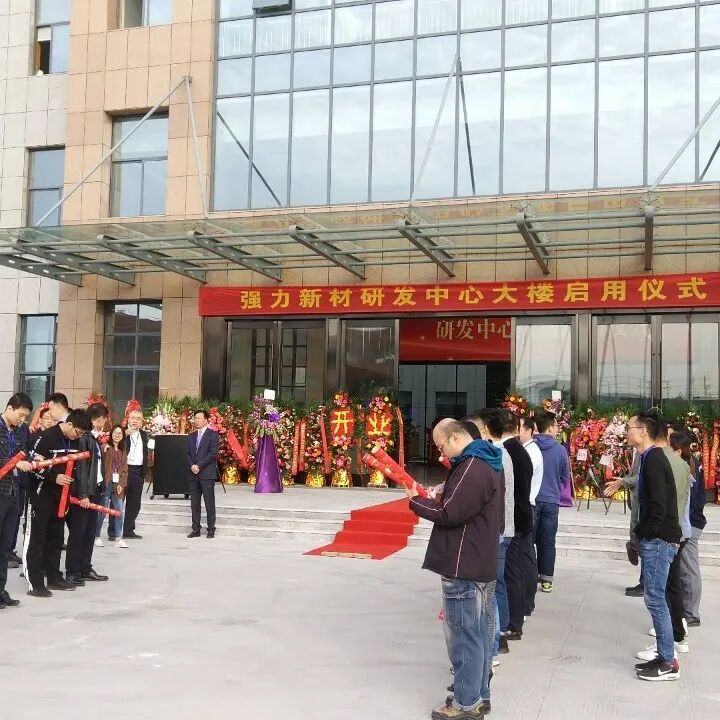
总裁办公室马娟娟

**马娟娟**

**回望总部启新，致敬甘载同行**

2018年10月18日，公司总部大楼正式启用，那一天的荣光至今历历在目。这座大楼拔地而起，不仅是公司发展的里程碑，更是我职业生涯最珍贵的见证。2026年，是我扎根公司的第二十个年头，恰逢公司上市十一周年，回望来路，满心感慨。

二十年风雨兼程，我从初入职场的新人，在公司的培养与历练中稳步成长，褪去青涩、沉淀专业，一步步与企业并肩前行。从创业初期的并肩坚守，到总部大楼落成的辉煌时刻，再到如今上市十一周年的稳健跨越，我的成长轨迹，始终与公司的发展同频共振、紧密交织。

总部大楼启用的那一刻，是新征程的起点。未来岁月，我将继续怀揣初心，深耕岗位，以二十载赤诚之心，陪伴公司行稳致远，共赴更广阔的征程。

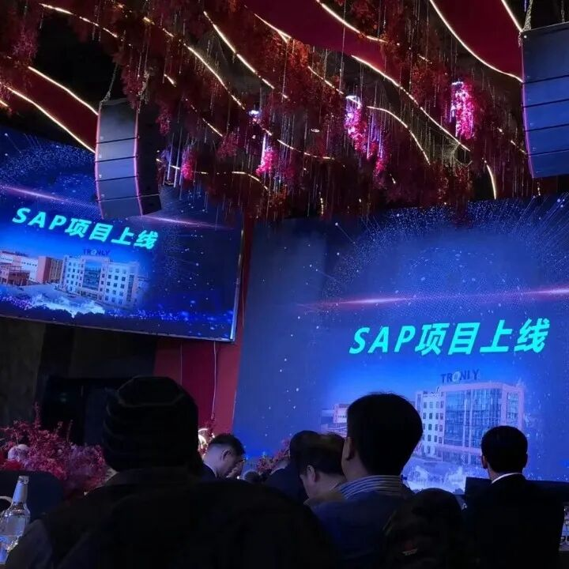
总裁办公室孙珣

**孙珣**

**系统铸根基，坚守伴成长**

回想历次业务升级，最难忘的还是当年SAP上线这块“硬骨头”。

当时我负责MM（物料管理）模块。为了理顺供应链，团队连轴转地清洗海量主数据、死磕期初库存和跨部门流程。上线大会那天，现场掌声雷动，但我根本没顾上激动，双眼死死盯着工作群。直到前线弹出一句“首笔采购入库（MIGO）顺利过账，数据正常”，紧绷了几个月的神经才彻底松下来，顺手拍下这张会场全景。

从当初扎在单一模块查报错，到如今陆续负责公司更多核心系统。随着业务扩张，经手的系统越来越复杂，但每次看到系统平稳支撑业务运转时的那份踏实感始终没变。这是我与公司共同成长最真实的见证。

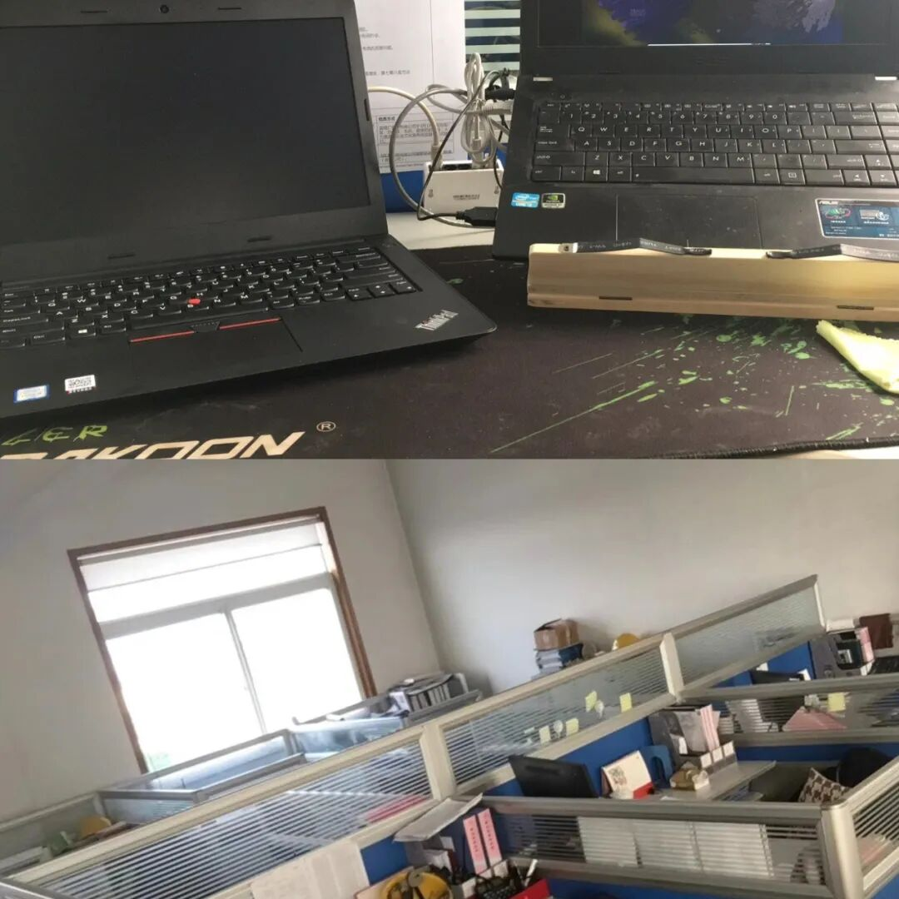
总裁办公室葛万强

**葛万强**

**一屏一坚守，一载一成长**

趁公司上市11周年翻出老照片，那张拥挤的办公桌，是我当年实施“虚拟桌面项目”的“主阵地”。

为保障业务扩张下的数据安全与协同，公司全面推行虚拟桌面。为测试兼容性，我的工位硬凑成了“小型机房”：三块屏幕错落交织，测试主力的ThinkPad常因高负荷发烫被我特意垫高。当时主屏配策略，副屏盯虚拟机，反复排查网络与卡顿问题，一盯大半天。当系统最终稳定流畅登入时，成就感无可替代。

从老旧格子间到现代办公区，从入职时的IT管理员到见证公司信息化底座日益坚实。那三块屏幕前的日夜，是我成长的缩影，也印证了强力新材一路走来的飞速发展。

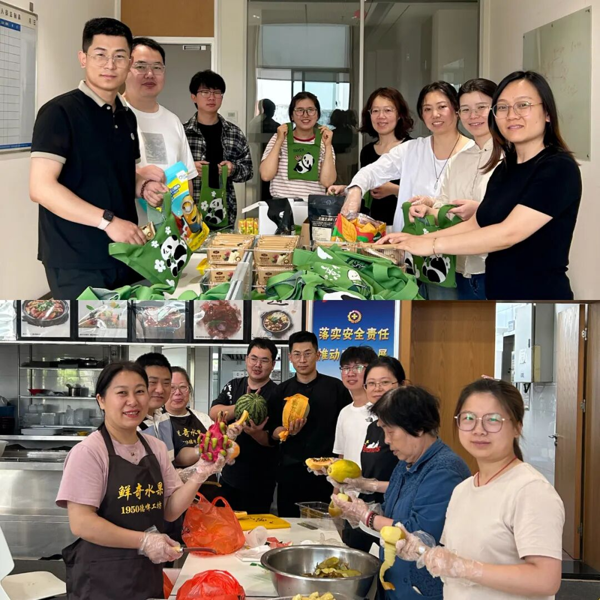
人才发展中心谢梦婷

**谢梦婷**

**那些亲手切出的甜**

2025年端午节，公司要给每位同事准备现切水果捞和人手一份零食礼包。眼看着上百份的量，我一个人根本忙不过来，只好求助同事。

没想到消息刚发出，就有同事探进头来：“我来帮忙！”很快，长桌边围满了人——有人卷起袖子切西瓜，有人蹲在地上分零食，有人把水果盒码得整整齐齐。大家说说笑笑，手上却一刻没停，那天的阳光照进来，整个办公室都是甜的。

中午，当同事们领到这份礼物时，满意的笑容让我特别满足。有人边吃边竖起大拇指；有人拍照发朋友圈。

这件小事让我明白，所谓“共赢”，不一定是宏大的战略。当我们需要人手时，大家都来了；当我们把用心传递出去时，每个人都感受到了被在乎的温暖。关怀让彼此走近，共赢就藏在这份走近里。

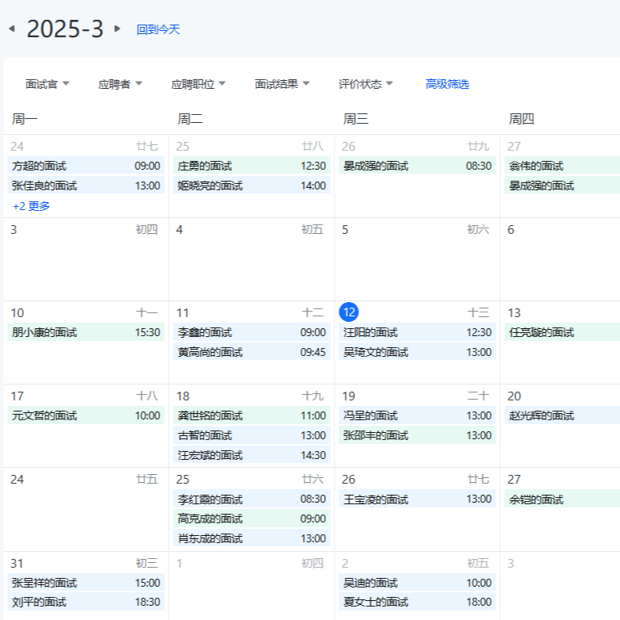
人才发展中心李海涛

**李海涛**

**攻坚克难、保障人力需求**

2025年春季是集团招聘需求的高峰期，热门行业的高端技术岗更是难啃的骨头，当时部门提出了招聘-电镀液资深技服工程师，总部所有招聘岗位，因同事休假，只有我一个人力承接。春招高峰期，各类岗位几百份简历涌入，电话及面试安排从早到晚。从简历搜寻到体检报告确认，每一个环节都得自己死磕，好几次候选人在最后关头被对手截胡，那种挫败感只能自己消化。整整两个月，经过反复沟通，部门同事间的积极配合，领导大力支持，硬生生从人才池里把她挖了出来。现在看着她成为部门的中坚力量，那种成就感是双倍的——不仅是为公司抢到了紧缺人才，保障了业务发展，同时也是岗位的胜利，更是组织战斗力的真实体现。

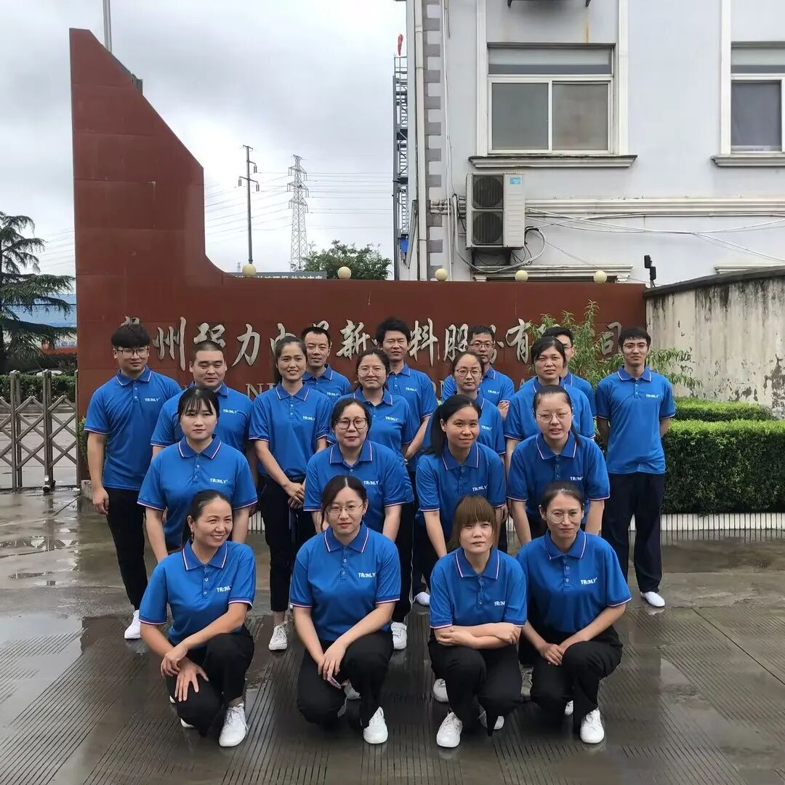
半导体材料事业部孙敏

**孙敏**

**一群人，一条心，一起赢**

2019年，公司组织五行健康操比赛期间，当团队训练遭遇瓶颈、进展放缓时，一种自发的凝聚力悄然涌现。小伙伴们主动放弃了午休，并在下班后自发留下，一遍遍反复练习，相互纠正动作，磨合节奏。这不仅是为了争夺名次，更深深感动于彼此不放弃、共同奋进的团队精神。最终，这份凝聚一心、额外付出的努力，为我们赢得了比赛第二名的好成绩，也留下了这一份关于拼搏与温暖的珍贵回忆。

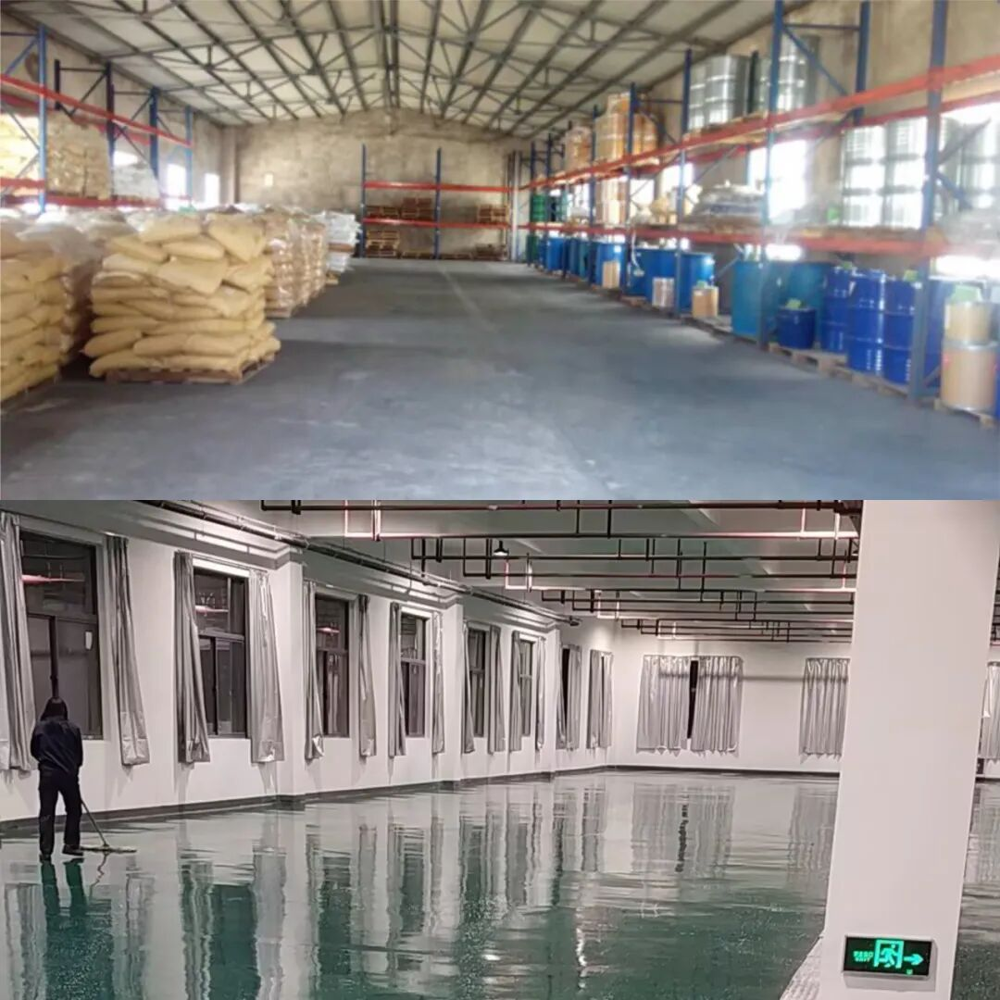
半导体材料事业部朱丽霞

**朱丽霞**

**仓库焕新，我亦成长**

2017年，公司仓库还只是简陋的彩钢瓦房，仓管员在堆积的货架间穿行，简单的把工具归位、地面扫净。那是关于“整洁”的第一课。十年一瞬，如今，眼前是有着温控要求的四层仓库，“6S”最要紧的“安全”和“精细”已刻进每一步流程，SAP系统每个数字跳动都代表着货物的进出，而我也从手写标签仓管员，成长为用数据守护物料的践行者。

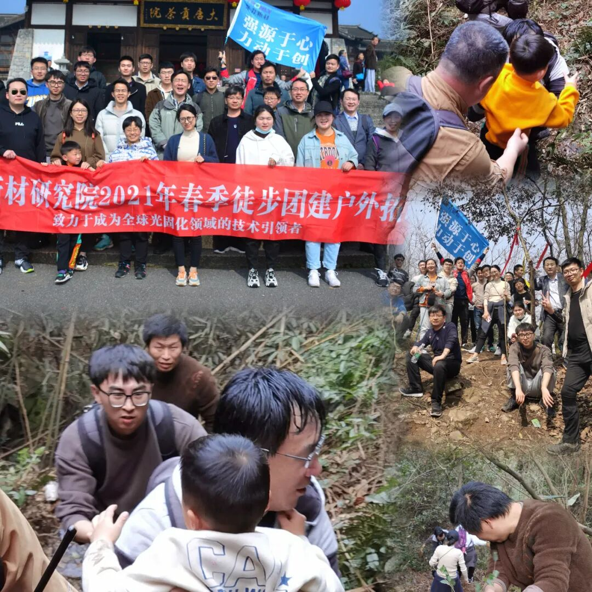
研究院金晓蓓

**金晓蓓**

**以心相伴，聚力攀登**

2021年研究院组织户外爬山团建，出发时大家兴致勃勃，到了山脚才发现，这群整日与瓶瓶罐罐打交道的人，对爬山的理解只停留在景区台阶。

眼前没有路，只有乱石与陡坡。起初还有说有笑，不久便只剩喘息。有人滑倒，有人被荆棘划伤，几位体力较差的同事在半山腰进退两难。

院长走在最后，将掉队的同事一个个往前推；前面的人站稳后，又回头拉一把伙伴，大家互相递水、背包、提醒路况。原本在实验室里各自专注数据的团队，瞬间凝成了一个整体。

傍晚下山，大家虽狼狈却格外兴奋。我们这群习惯精确数据与可控环境的人懂得：真正的成长，常在经验之外，在陡坡上的彼此搀扶中。能与这样的伙伴同行，与公司共成长，前路再险，亦无所畏惧。

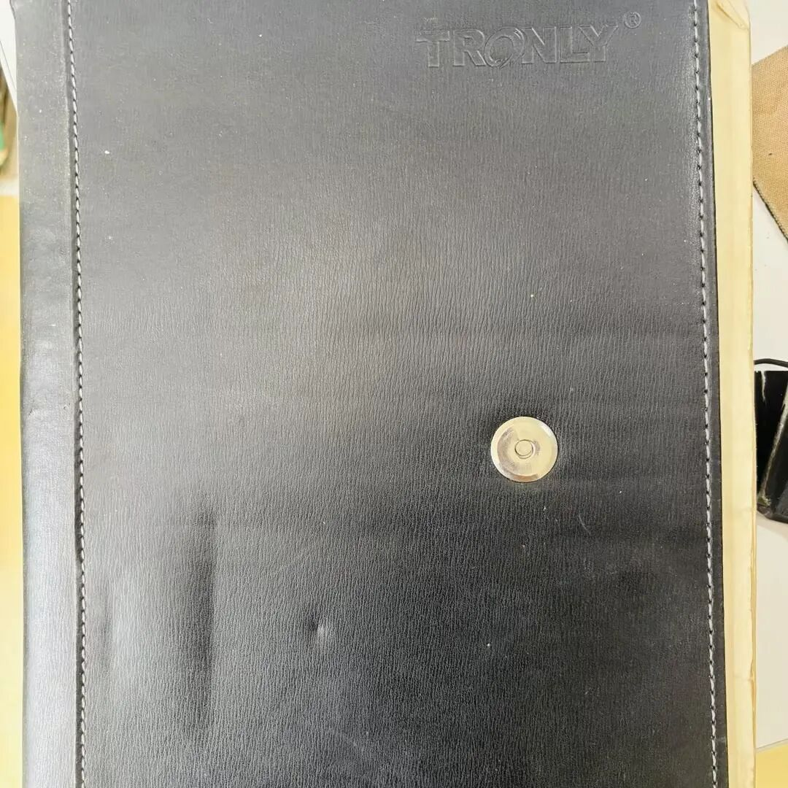
研究院于培培

**于培培**

**一本笔记，一份初心**

入职强力公司不久，我被调配到研发工作。在领取工作物品时，一本印着公司抬头的笔记本，瞬间让我忐忑的心安定下来，涌上一股难以言喻的暖意。它不是什么贵重物件，黑色封皮上低调的印着公司名称，摩挲着光滑的皮面，忽然就对这个陌生的环境少了几分不安。午休时，我在第一页写下了自己的名字，像是在与未来的自己定下一个庄重的约定：从今天起，我要在这里书写属于自己的职场篇章。后来我才知道，这本笔记本是公司为每位研发人员准备的“入职礼”，不少的办公桌上，都摆着写满字迹的同款本子。它见证过新人的懵懂，记录过项目的攻坚，也承载着无数个为目标拼搏的日夜。如今，我的笔记本里记满了当年工作要点，每一次翻开，当年在研发度过的时光便如同电影般在眼前回放。

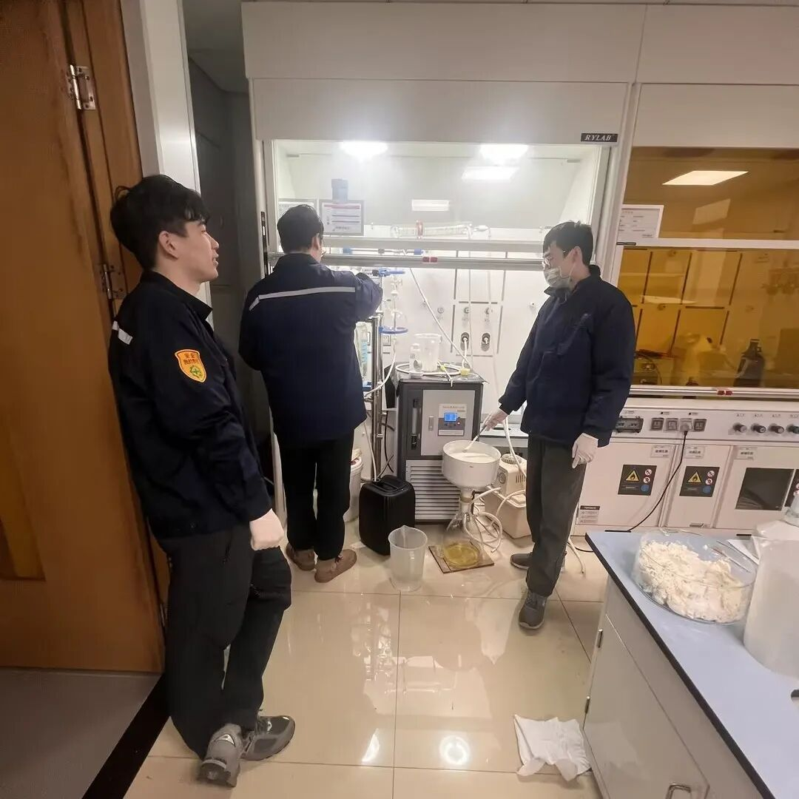
研究院姜超

**姜超**

**平凡守岗位，并肩筑强力**

2026年2月13日，距离春节放假只剩最后两天，实验室里依旧灯火通明。为了赶客户急需的样品，我们整个团队主动放慢了回家的脚步，在通风橱前并肩作战。

那天，从早到晚的实验操作让每个人都有些疲惫，可没有人抱怨，反而在一次次调试，藏着攻克难题的快乐。孙博也经常跑到现场，一边协调进度，一边给大家递鼓励，叮嘱我们注意安全。

这件小事让我真切感受到，公司的成长从来不是一个人的奔跑，而是我们每个人在平凡岗位上的坚守与担当。正是这些并肩奋斗的瞬间，让我们与公司紧紧相连，也让 “创新、诚信、关怀、共赢” 的价值观，在日复一日的实践里愈发清晰。

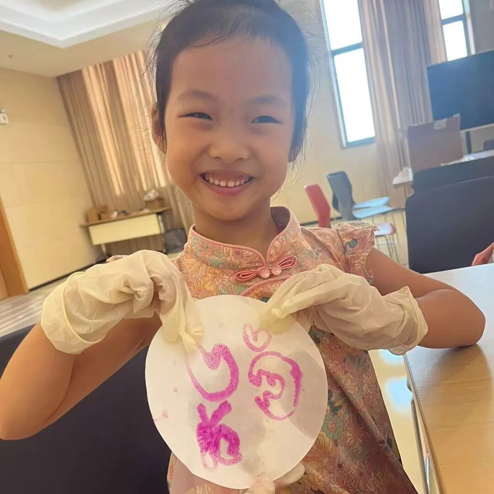
研究院毛玉兰

**毛玉兰**

**小手套，大好奇**

我还记得那年八月里特别的一天。阳光透过大楼玻璃幕墙，洒在干净明亮的展厅里。那是公司上市后的第一个家庭开放日，我牵着五岁女儿的手，第一次以这样的身份带她走进我每日奋斗的地方。

在展厅，她踮着脚听着公司的成长历程；在实验室，透过玻璃窗好奇地张望；食堂里，她和同事们的孩子坐成一排，用小小的手握着餐勺。最难忘的是科学小实验环节，看着她戴上大大的手套，小心翼翼地在完成神秘药水配置，那一刻，她的眼睛亮了起来——而我忽然意识到，这些年我与公司共同成长的轨迹，正以如此温暖的方式，照亮了下一代好奇的星空。

原来，成长不仅是市值的攀升、技术的突破，也是这些平凡日子里，一颗颗被点燃的童心。

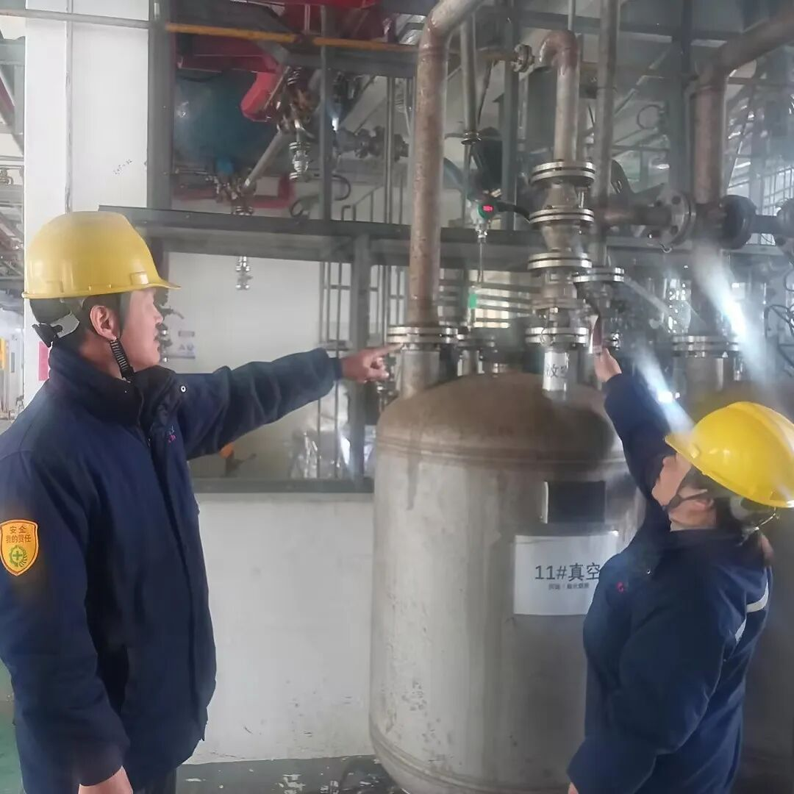
先端-生产二科樊丽芬

**樊丽芬**

**始于认可，忠于坚守**

2015年初，我有幸的加入了强力先端公司。最开始我被安排进入了二车间这个团队。通过了解，强力先端公司是自主研发创新的高新技术企业，生产：光引发剂、树脂等电子材料光刻胶专用化学品，在这个人才济济的大公司，我深知自己的不足，只有虚心、踏实的学好各种技能，积极进步才是上策。刚进公司一个月，一件事，让我深深地记在脑海里，一天，王伟班长让我去一下办公室，我问什么事，王班长说你去了就知道了。我忐忑来到了办公室，陈敏主任一脸严肃的对我说：“樊丽芬，你才来公司一个月吧，你看下你班长对你的绩效考核，100分，你知道这意味着什么，这是新员工从未有过的，也说明你这一个月努力的表现和结果。”我签完字，内心既激动又开心，我想这是领导对我的工作给予了肯定，让我更加有信心和动力去迎接更大的挑战，努力跟上大家的步伐，为公司创造更多的价值。

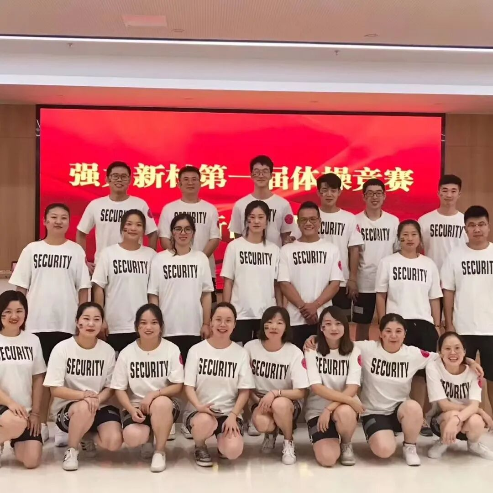
先端-生产计划科顾苗

**顾苗**

**跃动青春，聚力夺奖**

我最难忘的，是团队勇夺公司首届体操竞赛一等奖的经历。

作为公司首次体操赛，我们利用业余时间刻苦排练，从动作生疏、节奏不一，到反复打磨、彼此配合，全员齐心、无人掉队。2019年9月2日比赛当天，大家精神饱满、默契十足，最终不负努力斩获一等奖。

这段经历让我深刻体会到，荣誉来自同心同行。十一载同行，我将带着这份团结奋进之心，与强力新材携手共进、再创辉煌。

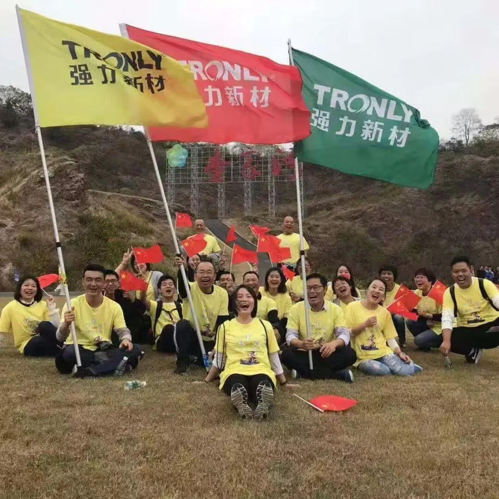
先端-生产计划科谢玉莲

**谢玉莲**

**郑青春，温暖同行**

回望与公司相伴的时光，虽无轰轰烈烈的成就，却有一件公益小事，始终温暖于心。

2018年11月13日，公司联合郑陆工会及公益组织，举办“快乐暴走・为爱同行”公益徒步活动。我最初只为参与放松，抵达集合点后，看着身着统一服装的同事、听着彼此的加油声，温暖与期待油然而生。

十公里徒步途中，同事们互帮互助、彼此鼓励，让疲惫烟消云散。更有意义的是，每完成一人暴走，公司便以全体参与者名义捐赠公益物资，我们的每一步都化作了实实在在的善意。抵达终点查家湾时，大家虽汗湿衣衫，却满是自豪。

这件小事，让我真切感受到公司的温度——这里不仅是奋斗的平台，更是引领我们向善的同行者。十一周年风雨相伴，公益温暖已成为强力人的精神底色。

未来，愿继续与强力并肩，以微光聚星河，在奋斗中传递温暖，共赴美好新征程！

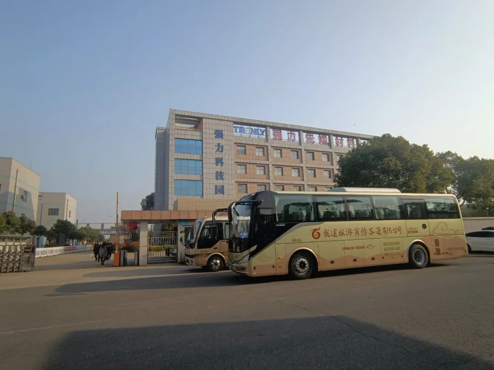
先端-生产一科黄吉才

**黄吉才**

**一路班车一路暖**

2013年我入职到强力，那时公司还没有班车，可苦了我们这些离公司远的员工了。我居住在城西，单位却在城东，与江阴交界，上下班的路程算得上是“长途”了。车间生产需要倒班，我熬了一夜夜班，骑行在芙蓉大道途中都快要睡着了，只能赶快驻车，靠坐在公交站台小睡一会后再出发;多少次在上班途中，小毛驴被扎胎，半途电池没电；更有一次骑车上夜班，天色昏暗，我误驶进了村庄里的养猪舍……我幻想着要是有班车那该多好啊。

几个月后，终于传来了公司开通班车的好消息，首先是遥观到先端的班车顺利开通，没多久又有了第二条，第三条班车路线，我乘车的站点也由远到近，由芙蓉大道转到黄河路泰山路站。

自从开通了班车，大大缩短了我上下班的路程，减少了路上的风吹日晒。班车上的同事有的聊着天，有的刷着手机看新闻时事，有的闭目养神，十分惬意。晨光透过车窗洒在我身上，道路两边的风景美不胜收，车拐了个弯，不知不觉就到厂了，真是舒心极了。公司不惜成本开通班车，不正是强力对我们员工的关怀吗？乘上强力的班车，一路上将带我们领略更多更美丽的风景，驶向未来美好的生活！

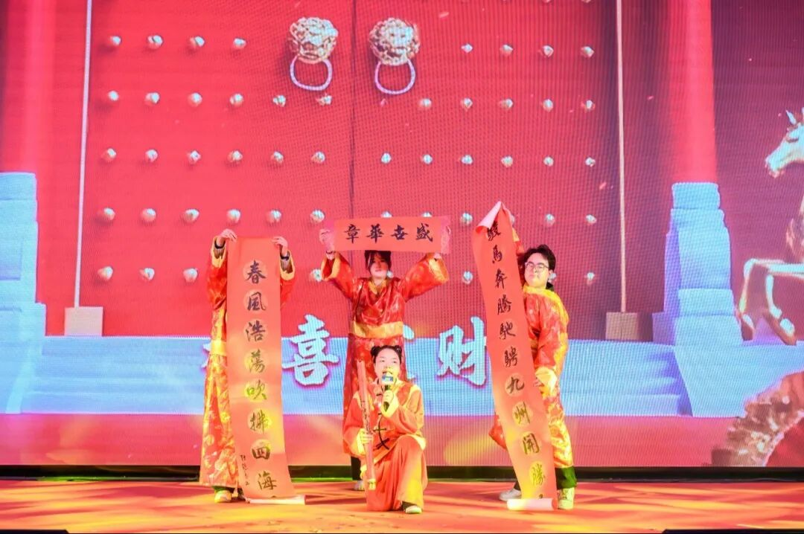
先端-品保科尹铭

**尹铭**

**那晚，我们脱下工装，跳了一支恭喜发财**

2026年的公司年会，是我记忆里最温暖的小事。

今年很荣幸去参加了总部年会，年会现场布置得温馨又热闹，大家褪去平日的工装，脸上满是笑容。

作为分析技术员的我们，平日总与精密仪器为伴，数着刻度、辨着成分，日子像滤膜般纯粹却单调。可今晚，我们要站上舞台，展现我们工作之余的风采，一支恭喜发财的舞蹈，让大家释放出工作的压力，尽情的感受年味的氛围感。虽然在台上，大家都很紧张，但是也阻挡不了我们的风采展现，可能表演的时候会有些美中不足，但是整体效果还是不错的。

也让我们明白了：原来生活不止有精准的数据，还有热烈的裙摆；不止有严谨的流程，还有肆意的风。那些曾囿于方寸实验室的时光，终在表演中绽放成光；那些勇敢踏出舒适圈的瞬间，都化作岁月里最动人的诗篇，让平凡的日常，自此多了一抹熠熠生辉的绚烂与滚烫。

这场年会用一个个温暖的小瞬间，让我们快速的融入了强力这个大家庭。这一件小事，让我更加珍惜与公司、与同事相伴的时光，也期待未来和公司一同成长，共赴新征程，再创新辉煌。

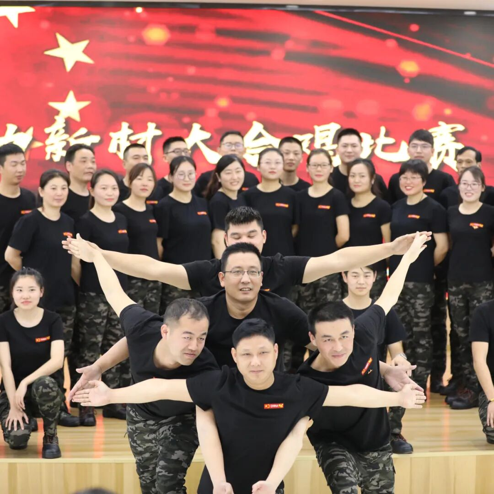
先先-综合科徐彬

**徐彬**

**一件小事，唱响同心**

强力新材上市十一周年之际，回望在先端公司的时光，最让我热血沸腾的，是团队参加大合唱比赛、以《军魂》斩获一等奖的经历。

为展现公司风采与强力人精气神，我们利用下班后的时间排练，无专业老师就跟着音频练习，有人跑调、忙碌，大家便互相纠正、主动分担。从生疏到整齐，歌声里盛满默契与团结。

2019年11月27日，我们身着统一服装登台，齐声高歌，每一句都饱含真情。夺冠时刻，全场欢呼，喜悦与自豪溢于言表。这件小事让我懂得，一群人同心同向，便能唱响最强音，唱响强力军魂。未来，我将带着这份力量，与强力新材共赴新辉煌。

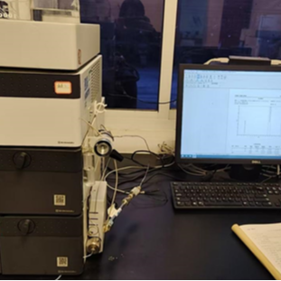
佳英-品保科岑甜

**岑甜**

**仪器懂我，我亦成长**

照片里这台液相色谱仪，是我每天上班最先见面的 “同事”。

2023年应聘化验室组长时，我以为维护仪器不难，真正干起来才发现，会维护是一回事，能把仪器伺候明白是另一回事。

刚来一切平稳，直到有一次液相压力突然波动，数据飘得没法看。常规排查无果，我硬着头皮拆开进样器，发现是密封圈老化。换好配件重启，基线稳稳走起来的那一刻，我才懂得：组长不只是统筹安排，更是仪器出状况时能自己上手修好。

两年多下来，我和这台液相越来越熟，更换密封圈、清洗过滤头、处理异常数据，如今化验室的气相、液相设备基本都能搞定。

操作是基本功，能修好 “闹脾气” 的仪器，才是真正的成长。公司上市十一周年，我陪伴不到三年，看着仪器稳稳运行就很踏实。未来日子还长，继续互相照应。

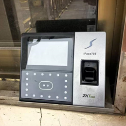
佳英-综合科金海红

**金海红**

**温柔相助，即刻融入**

我入职公司第二个月的某一天，雨势渐大，我站在保安室门口，对着一台指纹考勤机犯了难。新员工的入职手续还没办完，可考勤机却像跟我作对似的——手指放上去，屏幕总是冷冰冰地跳出“验证失败”。

看着新员工们神情焦急，我心里愈发着急。就在这时，孙姐撑着伞快步走来：“别慌，我来试试。”说着，她把伞往我这边倾斜，又从口袋里掏出一张记着考勤机操作要点的便签纸塞到我手里。话音刚落，孙姐便开始利落地调试设备。一分钟后，“嘀”的一声清脆提示音划破雨幕，考勤机终于亮起绿灯，新员工的信息成功录入。

那一刻我才明白，融入一个新团队最快的方式，或许就是被这样一份带着温度的帮助温柔接住。

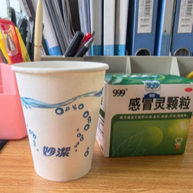
佳英-综合科吴丹凤

**吴丹凤**

**一杯热饮暖人心**

入职佳英近四个月的一天，上班临近吃中饭时，我突然感觉头昏昏沉沉，连打字都提不起劲；更别说去吃午饭了。临近下午13：00左右，同事金姐突然走到我的桌前，把一盒感冒灵和杯子放在我面前：“喏，刚给你冲了一杯，趁热喝，别硬扛。”她没多说什么，转身就回到了自己的办公桌前。但那杯热水的温度，却一直暖到心里。后来才知道，是她特意点了外卖，让人及时送到公司的。这盒感冒灵，不只是药，更是一份无声的牵挂。它提醒我，在佳英这个大家庭里大家虽然不是你的亲人，但也有人默默记挂着你。那一袋药、一杯水，是职场里最朴素的温情，也是生病时最珍贵的安慰。

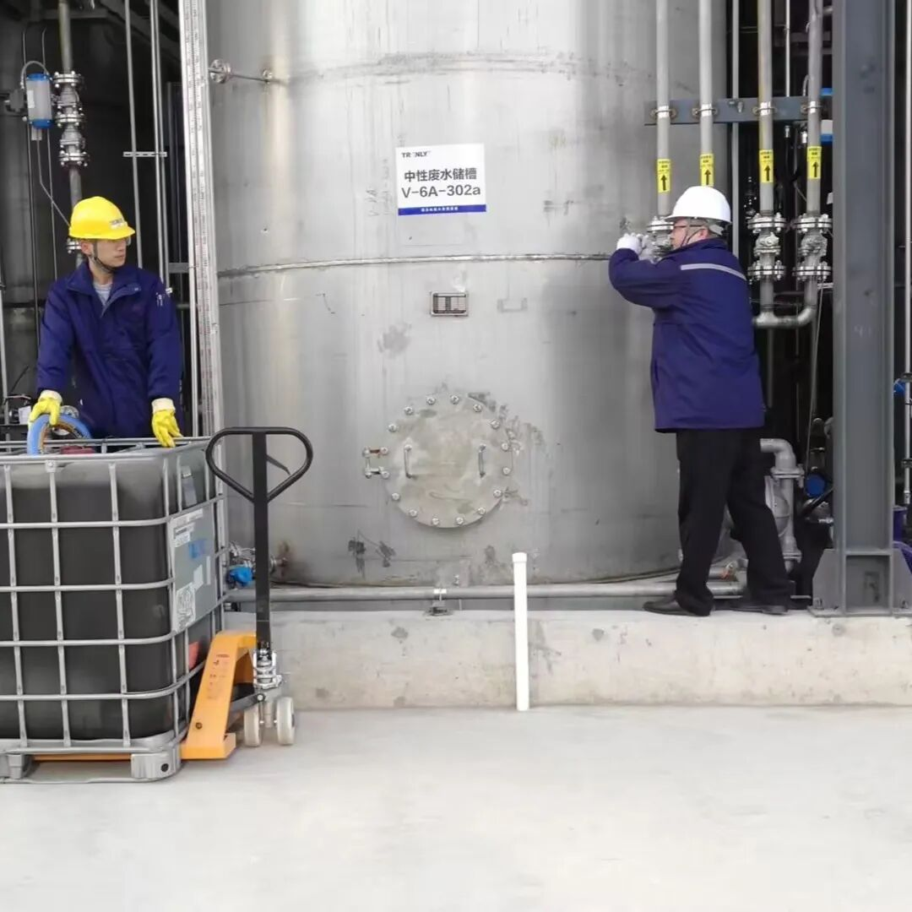
光电-生产科顾明天

**科**

**顾明天**

**试产践初心，微光聚力量**

值此强力新材上市十一周年之际，作为老员工，我自2021年12月转入光电公司，至今已相伴5年。最难忘的，是2022年1月12日第一次参与光电项目试生产的经历。

那些日夜，我们团队全力以赴，从设备安装、点位调试到工艺调试，每一步都严谨细致、齐心协力。当试生产方案二次评审通过，六车间废水产线成功启动，所有疲惫都烟消云散。

这件小事，让我读懂了强力人严谨务实、攻坚克难的精神。十一载砥砺，这份精神指引前行。未来，我将坚守岗位，与强力新材同心同行，共赴辉煌。

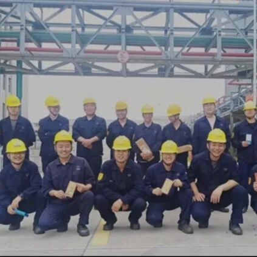
光电-安环科邱文达

**邱文达**

**难忘的安全月活动**

在光电公司第一次组织安全月活动，我策划了“三人四足接水带”趣味竞赛。赛前一周反复推敲细节，却在人员分组、比赛规则上卡壳，终于在同事讨论中定下公平又有趣的方案。

活动当天，同事们穿着藏青工装、戴着明黄安全帽列队，我站在人群前手心直冒汗。领导和同事主动上前维持秩序，原本预想的混乱在大家搭手下变得有序热闹。我举起扩音器喊出“比赛开始”，绑着荧光绿腿带的队员们跌跌撞撞冲向终点，有人踉跄稳住，有人笑着扶起队友，加油声在厂区里格外清亮。

最后一组冲线，看着同事们捧着奖品笑作一团，我忽然明白：个人的成长从来不是孤军奋战，就像生产线环环相扣才能跑出好成绩。这场小小的比赛，让我真正融入了这个集体，也读懂了“安全”二字里藏着的协作与担当。

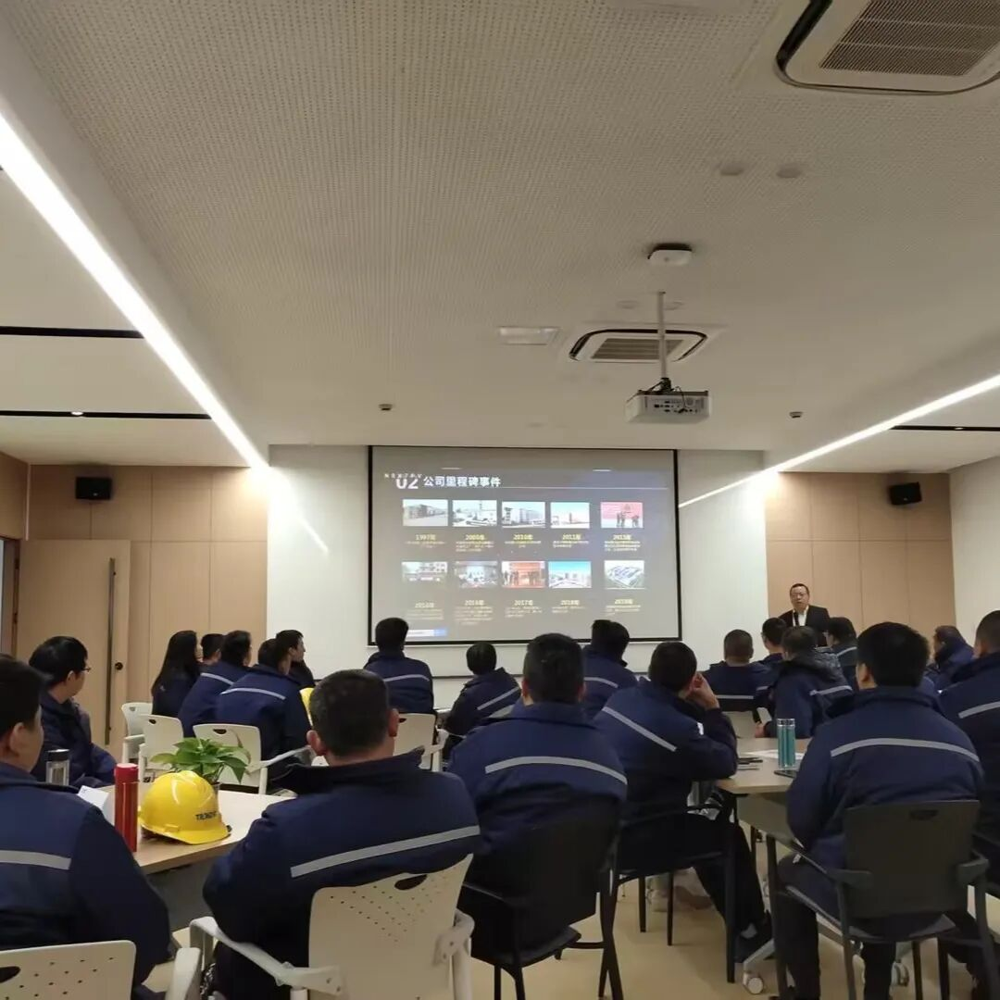
光电-生产科袁忠华

**袁忠华**

**一堂课，一份光，一段同心路**

在强力新材上市十一周年的美好时刻, 最让我难忘的一件事，就是第一次以讲师身份参加光电“飞虎训练营第一期”培训活动，为全员开展培训。

接到任务时，我既荣幸又紧张。为了讲好这堂课，我利用下班时间反复梳理课件；对着镜子练习, 成了我心里最踏实的记忆。

2021年12月9日培训当天，当我站在全体同事面前，我认真讲解，大家仔细聆听、积极互动。课堂上没有距离，只有彼此学习、共同进步的真诚。一次堂课虽小，连接的却是一颗颗同心同向的心；一次分享虽轻，传递的却是光电团队并肩前行的力量。

十一年砥砺前行，微光亦可照亮远方。未来，我将继续带着这份初心与热情，与强力新材同心同行，在平凡岗位上发光发热，共同奔赴更精彩的下一个十年！

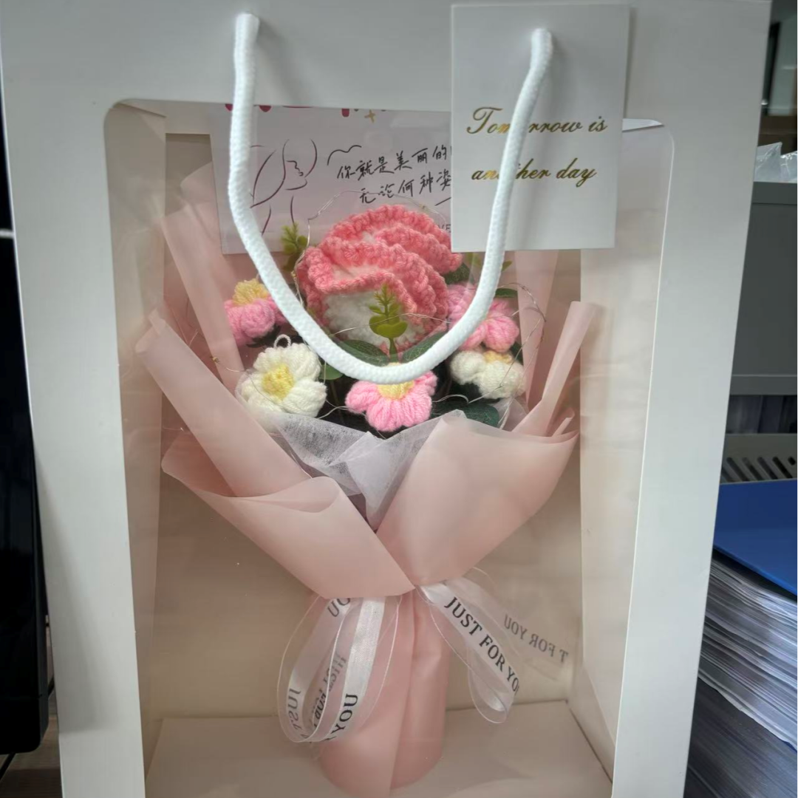
光电-品保科周海荣

**周海荣**

**一份匿名花束，照亮我的职场初心**

刚入职不久，我迎来在公司的第一个三八女神节。节前两天，我像往常一样安静工作，午休回来时，工位上竟多了一束精致的小花束。没有署名，只有一张小小的卡片，上面写着：你就是美丽的风景，无论何种姿态！

我又惊喜又疑惑，不知道这份温柔来自谁。问了身边同事，几经打听才知道，是一位平时很少交流的同事悄悄送来的。

当我向她道谢时，她只是淡淡一笑。那一刻，我所有的陌生、拘谨与不安，都被这束花和这句话轻轻融化。

这件事虽小，却让我真切感受到公司温暖包容的氛围。原来在这里，每一个人都能被看见、被善待。这份不期而遇的善意，让我更快扎根成长，也让我始终相信，温柔与善意，是职场里最珍贵的力量。

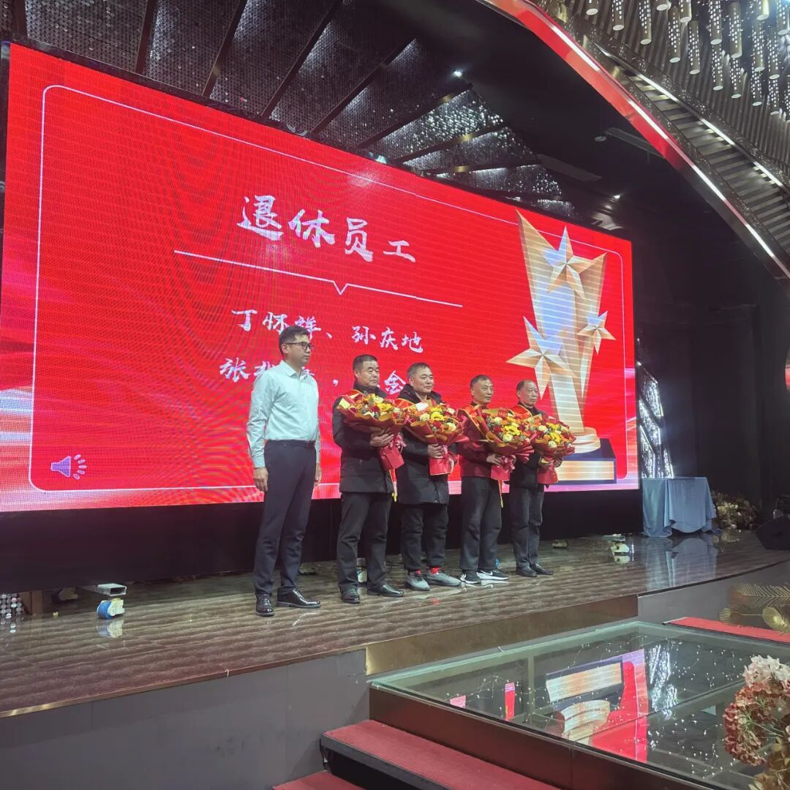
光电-综合科庄丽

**科**

**庄丽**

**岁月敬长者，微光成星河**

今年1月31日，强力光电第一次把年会搬进酒店宴会厅，灯光璀璨，舞台比往年都大。晚会过半，主持人忽然说：“今天来了几位特殊的家人。”灯光扫向靠近舞台的那一桌。四位白发老人缓缓起身，张兆海走在最前面，腰板挺直，程总亲自为他们佩戴“光荣退休”绶带，送上鲜花，他们并排站在台上，灯光打在花白的头发上，亮晶晶的，掌声响了很久。

散场时，我听见张兆海对身旁年轻人说：“没想到公司还记得我们这些老家伙，真好。”他低头看了看绶带，又看了看手里的花笑了。

那一刻我明白：最好的传承，不是记住数字，而是记住人。

强力上市十一年，有过艰辛，有过难关，但一代代人接力走过。我知道，最亮的光从来不是舞台灯光，而是那些白发苍苍的眼睛里，依然燃烧的火苗。

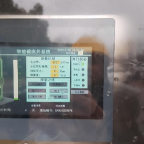
新宇-安环科贺正军

**贺正军**

**小妙招大效率**

怎么办？怎么办？配制聚丙烯酰胺溶液里面总是有成团的难溶块团，使用过程中堵塞管道，导致计量泵流量不稳定，影响生产工艺稳定。我们只有一步步摸索，先是将浓度从0.2%降为0.1%，还是存在这种状况。投加时缓慢、均匀抛洒，虽有好转，但仍然难杜绝且严重影响工作效率。

后来我们先开搅拌器，将溶液罐加水至90%，然后用接有鸭嘴形喷嘴的软管一边向罐内边沿喷水，一边将聚丙烯酰胺倒在喷水线上面，又快又均匀，配制的溶液再也没有块团难溶物了！

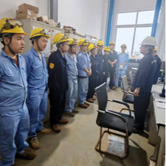
新宇-安环科邓钻

**邓钻**

**我的“初代同事”**

2025年6月，我作为应届毕业生踏入安环科，恰逢公司上市11周年。这于公司是里程碑式的跨越，于我则是职场生涯的全新起点，我在这里遇见了给予我无数温暖的“初代同事”。成了我职场路上最坚实的依靠。

初到一线操作岗的我，自认天资愚笨，转料、投料、离心学得很慢，操作节奏也屡屡跟不上。但这群伙伴从未有过半句责怪，总是主动揽下繁杂工作，他们不厌其烦地拆解操作细节，耐心纠正我的每一处失误，用包容与温柔托举着我的成长。

公司上市11周年，我也从懵懂新人慢慢蜕变，这份成长里，藏着初代同事最温暖的托举。我会带着这份善意，在岗位上稳步前行，不负他们的期许，也不负与公司共成长的时光。

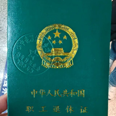
新宇-综合科张莉

**张莉**

**致敬三十年坚守**

今年初春送别彭师傅的场景，仍历历在目。

作为新宇设备科2026年第一位退休的机修工人，彭师傅在岗将近30年，从风华正茂到甲子老人，他用精湛的焊接制作手艺，完成了一个又一个艰难的维修任务。那天当彭师傅终于拿到他的退休证，他突然红了眼眶，哽咽道：“三十年，从建厂第一根桩打到今天，我陪伴新宇走过了风雨三十年……”他粗糙的手反复摩挲着退休证，仿佛在抚摸一段岁月。

握手告别时，那双布满老茧的手传递的温度让我顿悟：人力资源工作不仅是招聘、考核、发薪，更是守护每一位奋斗者的人生轨迹，见证他们如何将青春嵌入企业发展的年轮。 那一刻我明白，公司的厚度，正是由这样一双双手、一个个三十年累积而成。而我何其有幸，能成为这些珍贵瞬间的记录者和守护者。

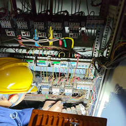
新宇-设备科徐福

**科**

**徐福**

**细节守安全，匠心护生产**

在刚来公司的时候，一次例行巡检，我和师傅发现污水站角落的控制箱接线处发热发烫。刚入行时我只当小问题简单处理，如今深知电无小事。随着公司产能不断提升，线路负荷也随之加大，这正是企业发展中需要守住的安全细节。 我和师傅打开箱体，仔细排查、紧固端子、重新做绝缘处理，确保线路稳定可靠。看着设备恢复正常运行这件小事让我彻底明白，电工从不是简单的维修更换，每一次排查、每一次紧固、每一次隐患消除，都是在为公司安全生产保驾护航。我在钻研技术、扛起责任中快速成长，从一名青涩新手变成独当一面的岗位能手；公司也在我们全员守细节、保安全的努力中，产能稳步提升、发展蹄疾步稳。

📌 投票须知

本次评选共收到33篇真挚投稿，由于微信投票限制，我们将其分为两组进行。

每组请各投1票（共投2篇），最终我们将合并两组票数进行统一排名。

感谢您的理解与支持，为触动你的故事助力吧！👇

**END**
