# 全员套圈，100%中奖丨强力新材2026元宵节活动热闹收场

> **作者**: 强力新材 | **发布时间**: 2026年3月3日 16:43

---

**欢度元宵节**

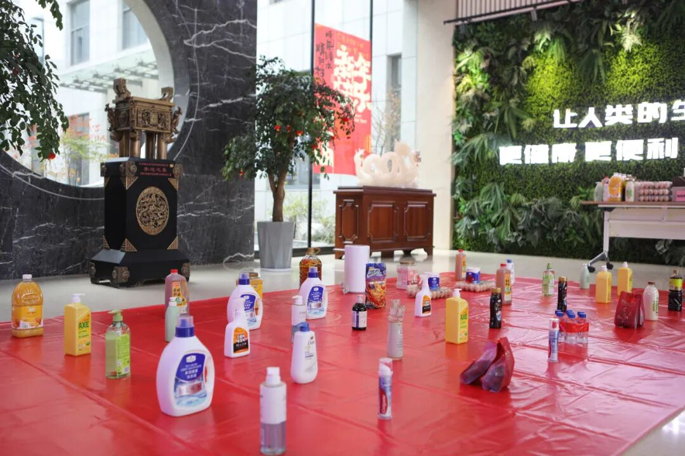
活动现场全景，地面铺着红色塑料布，摆满了套圈游戏的奖品

农历正月十五，元宵佳节。为弘扬传统文化、丰富员工文化生活，3月3日中午，强力新材遥观总部一楼大厅举办了“2026年元宵节套圈”活动。本次活动面向总部全体员工，秉持“全员参与、人人有奖”的原则，现场气氛热烈，欢声笑语不断。

**精心筹备，奖品丰富**

🎋

🎋

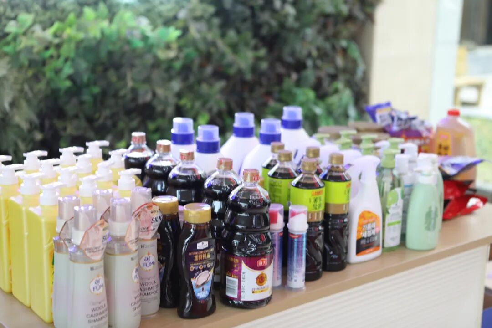
套圈游戏奖品展示：各式洗护用品

套圈游戏奖品展示：果汁、鸡蛋等生活用品

套圈游戏奖品展示：卷纸和清洁用品

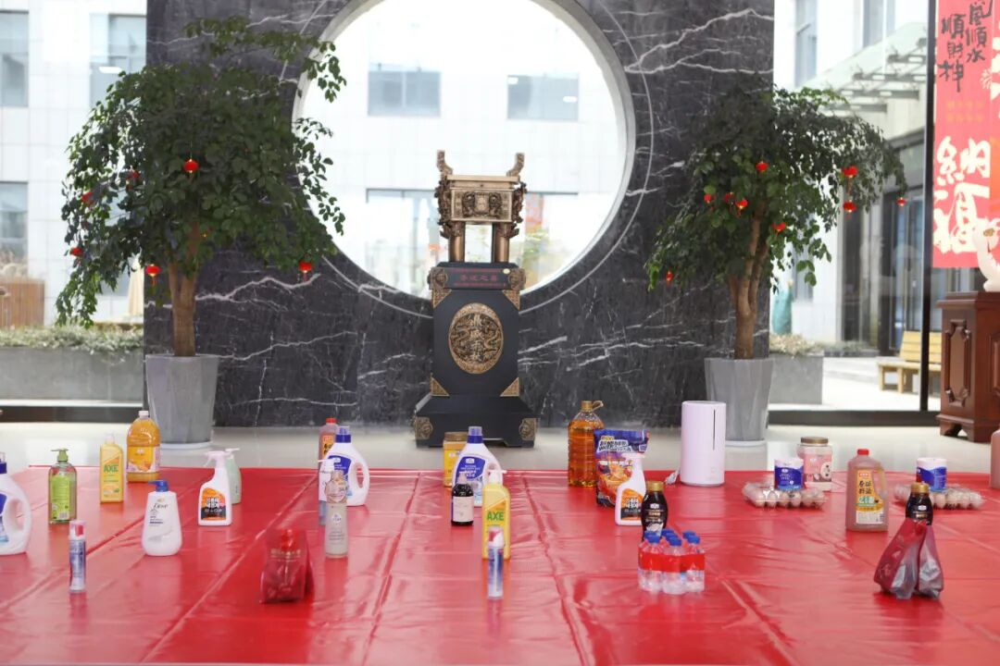
活动现场全景，展示套圈区域布置

活动开始前，一楼大厅被布置成开阔的套圈场地。地面上整齐摆放着各类实用奖品，包括厨房洁具、家清纸品、衣物清洁、卫浴清洁、零食礼包等，品类丰富，兼顾实用与趣味。奖品按价值分区域设置，近处为普惠区，远处为惊喜区，满足不同参与者的选择。

工作人员提前规划动线，安排专人分发套圈、维持秩序，确保活动有序进行。每位员工排队领取套圈，参与即有机会赢取心仪奖品，即便未能套中，也可凭参与券领取一份纪念奖，真正实现100%中奖。

**热情高涨，氛围热烈**

🎋

🎋

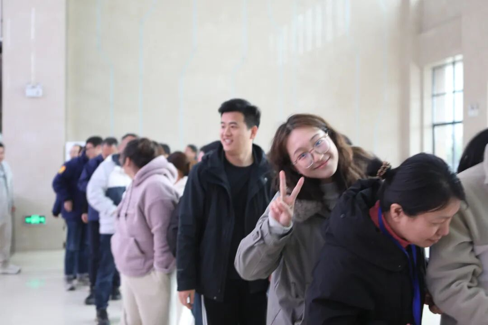
员工排队参与活动，参与者正在比耶合影

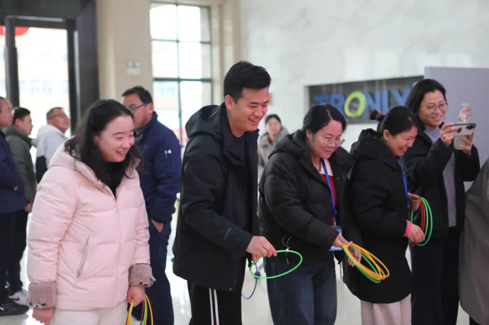
员工参与套圈游戏，神情专注

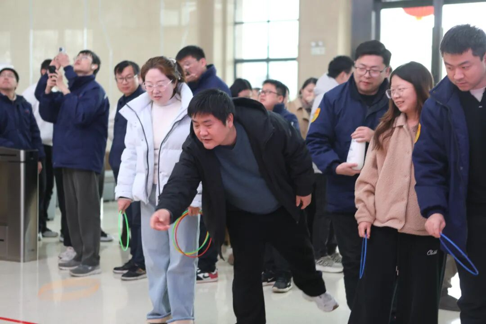
员工正在抛掷套圈，周围同事观看

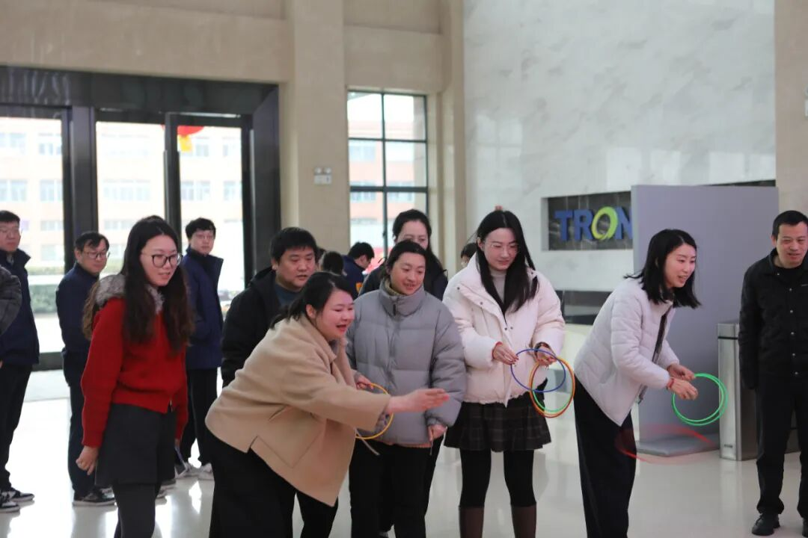
员工们正在进行套圈游戏活动

中午11时30分，活动正式拉开帷幕。员工们陆续来到大厅，自觉排队等候。现场人头攒动，热情高涨。大家手持套圈，或凝神瞄准，或轻松投掷，每当圈环精准落下，周围便响起阵阵掌声与喝彩。厨房洁具、衣物护理、家清纸品、零食饮料等热门奖品区域人气最旺，套中者喜笑颜开，未中者亦在后续尝试中收获惊喜。

活动中，不少员工展现出精湛的套圈技巧，连续套中多件奖品；也有员工重在参与，享受过程，最终在纪念奖区领取一份心意。整场活动持续一个小时，奖品陆续被认领，员工们满载而归，脸上洋溢着节日的喜悦。

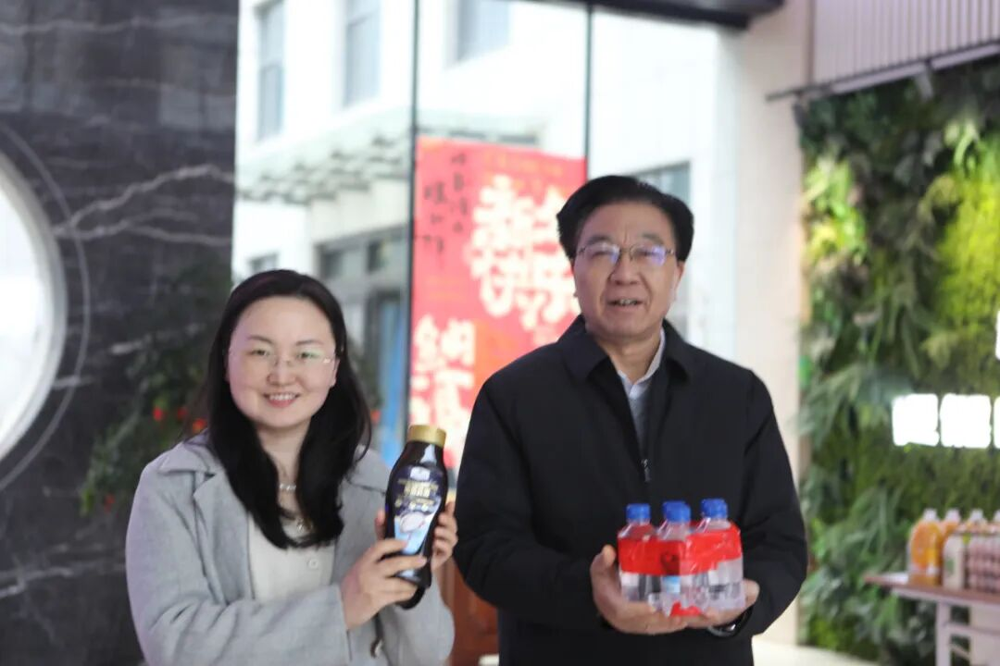
两名员工在元宵节活动现场展示奖品（饮料）。

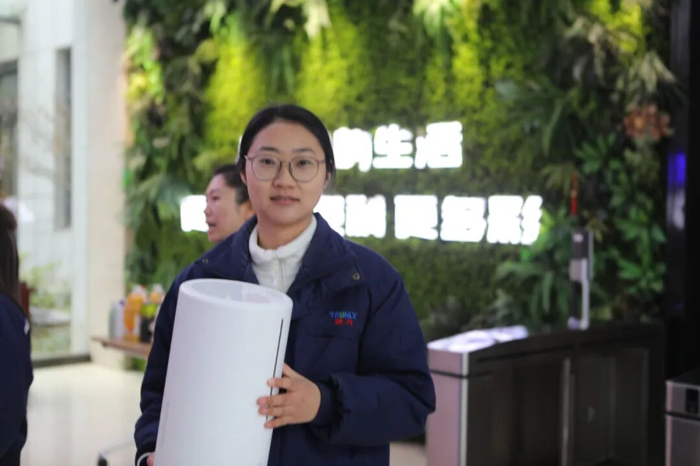
一名员工在元宵节活动现场展示奖品（家电）。

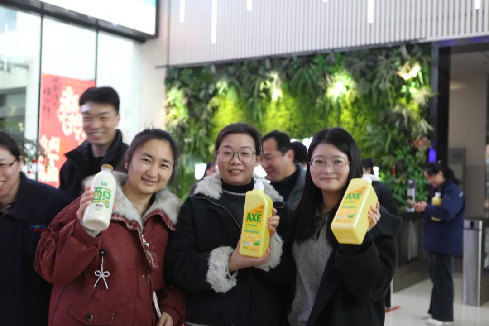
三名员工在元宵节活动现场展示获得的各类奖品。

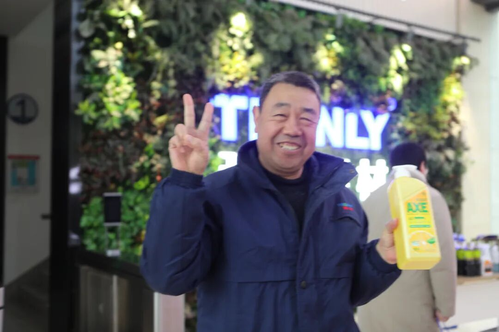
一名员工在元宵节活动现场展示奖品（洗护用品）。

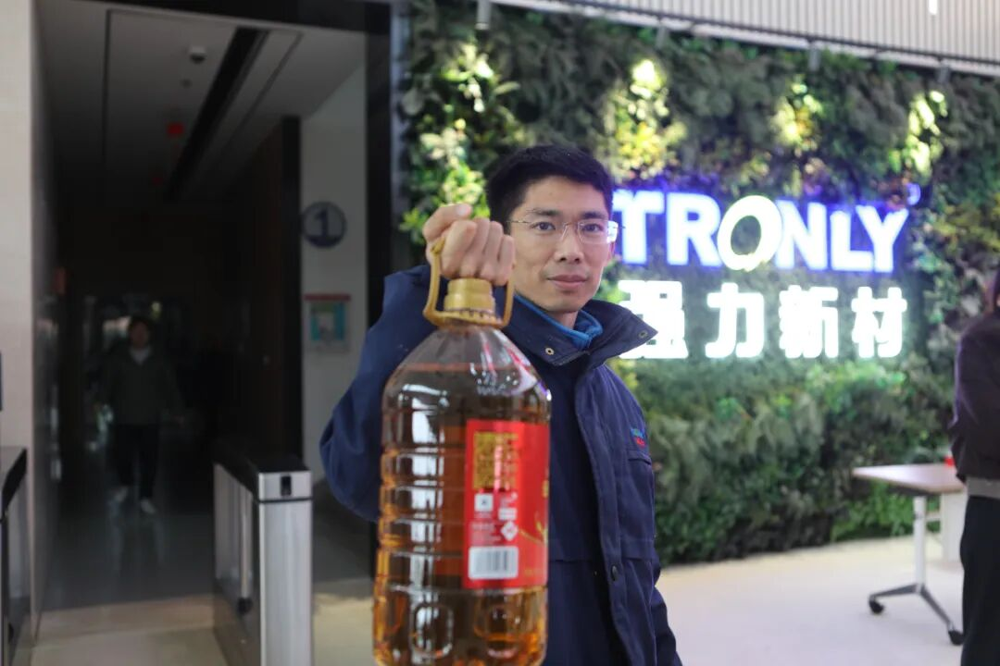
一名员工在元宵节活动现场展示奖品（食用油）。

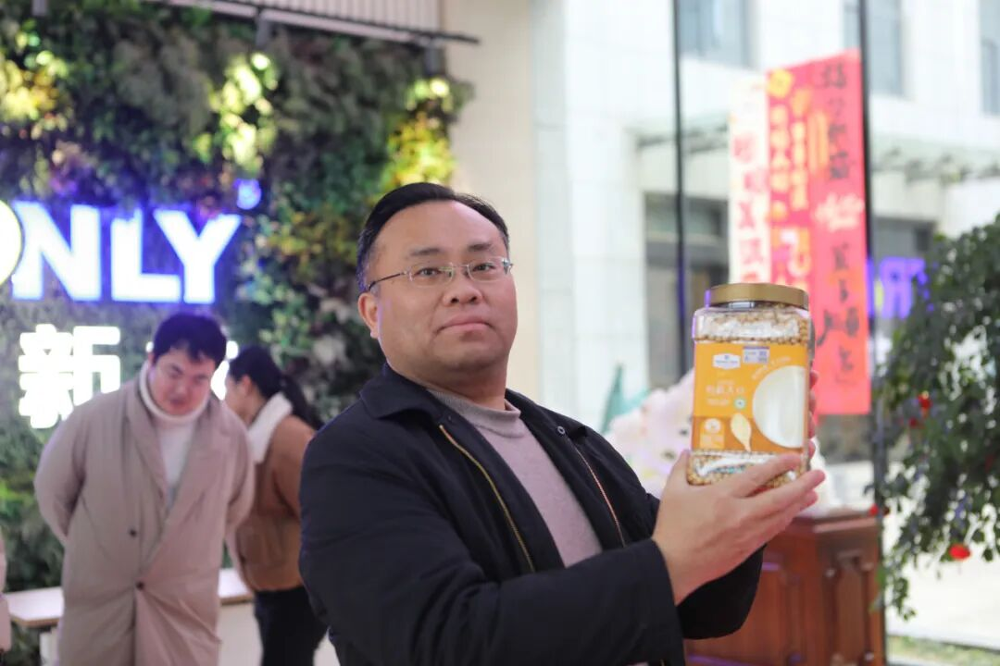
凝聚人心，共庆佳节

🎋

🎋

此次元宵套圈活动不仅为员工提供了放松身心的机会，也增进了跨部门同事间的交流与互动。大家在忙碌的工作之余感受到公司的关怀与温暖，进一步提升了团队凝聚力。一位参与活动的员工表示，这样的活动既有趣又有意义，让大家在欢乐中迎接新一年的工作。

2026年是农历丙午马年，元宵节的圆满落幕也标志着春节的正式结束。新的一年，强力新材将继续举办更多形式多样的文化活动，营造积极向上、团结和谐的企业氛围。

祝愿全体强力人在新的一年里工作顺利、身体健康、万事如意！
