# 匠心传承 智创未来｜红运机械司庆暨2025年度表彰颁奖典礼隆重举行

> **作者**: 红运机械 | **发布时间**: 2026年3月4日 17:32

---

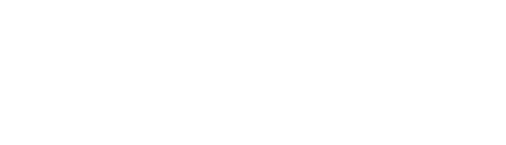

**匠心传承 智创未来**

**红运机械司庆**

**暨2025年度表彰颁奖典礼隆重举行**

**2026年3月3日（正月十五），红运机械司庆暨2025年度表彰颁奖典礼在常州总部基地和广州基地同步隆重举行。公司董事长吕范乐、总经理吕柏良、副总经理付启兰、常务副总经理刘益君、研发副总经理王召群、运营副总经理韩鹏、生产副总经理高新华等公司管理团队，与全体红运家人、供应商伙伴齐聚一堂，共同庆祝这一美好时刻！**

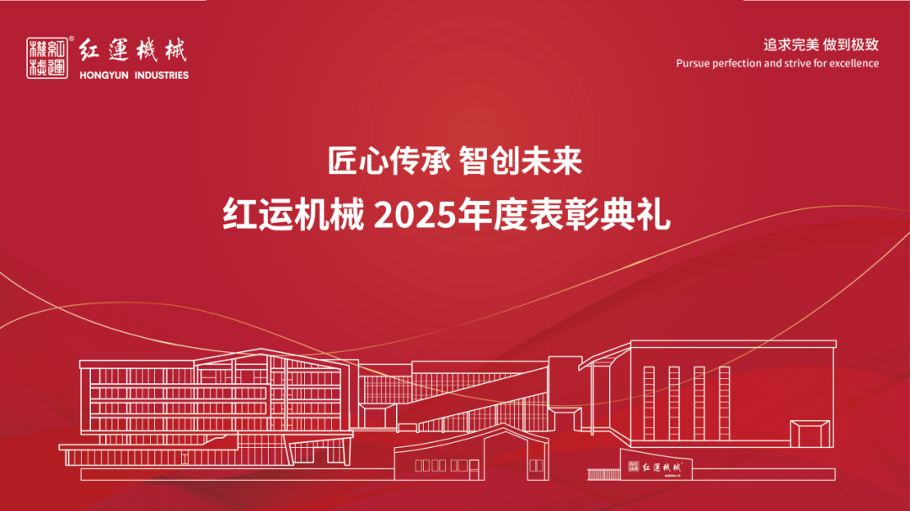

**01**

**舞狮纳福，盛典启幕**

上午8时18分，常州总部基地举行醒狮采青旺场仪式，为庆典活动拉开序幕。

瑞狮采青纳福，为红运机械新一年业绩长虹、步步高升许下祝福，更寄托着全体红运人对技术创新、业绩攀升的极致追求。

舞狮巡场续写祥瑞，锣鼓喧天，瑞狮踏福而行，穿梭于厂区各处，将喜气与福运传递至每一个角落。

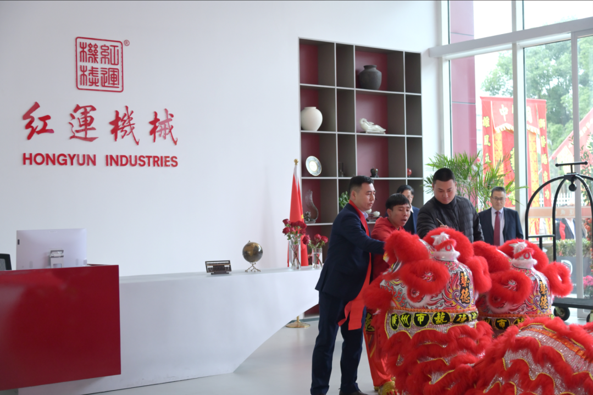

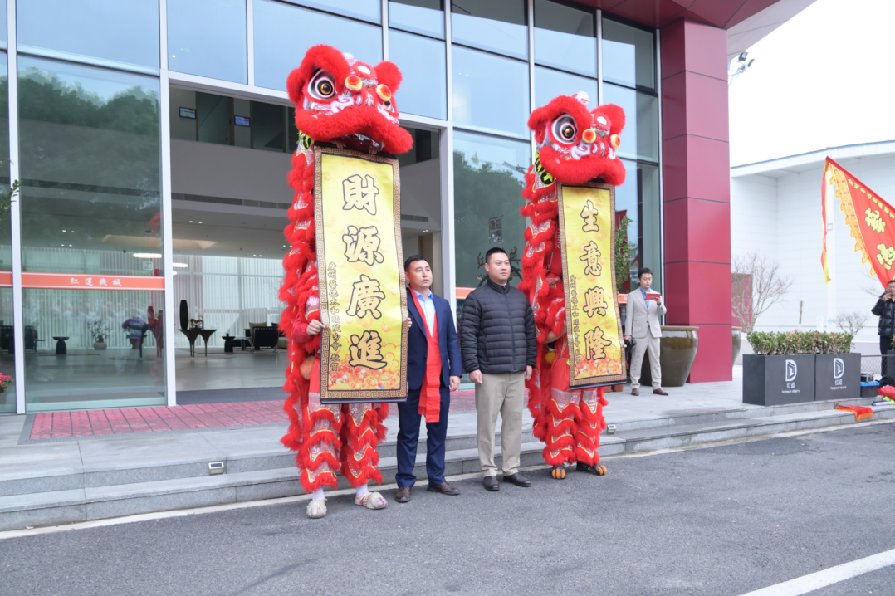

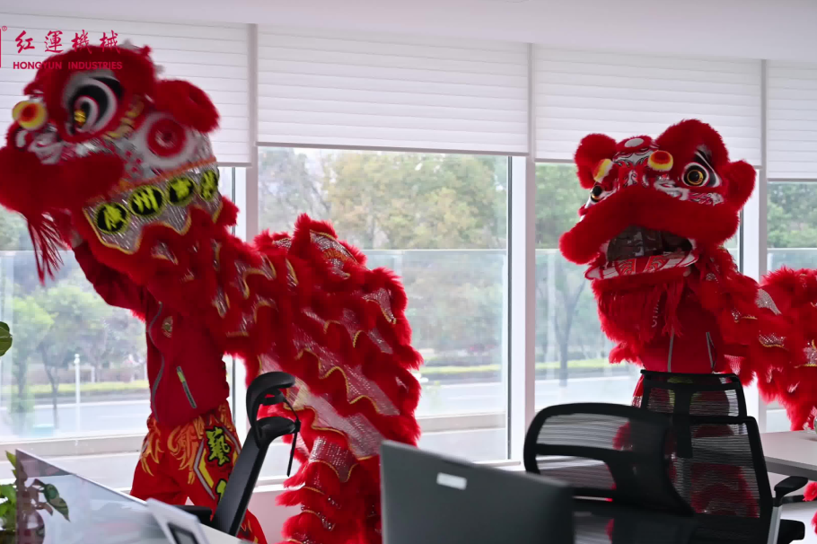

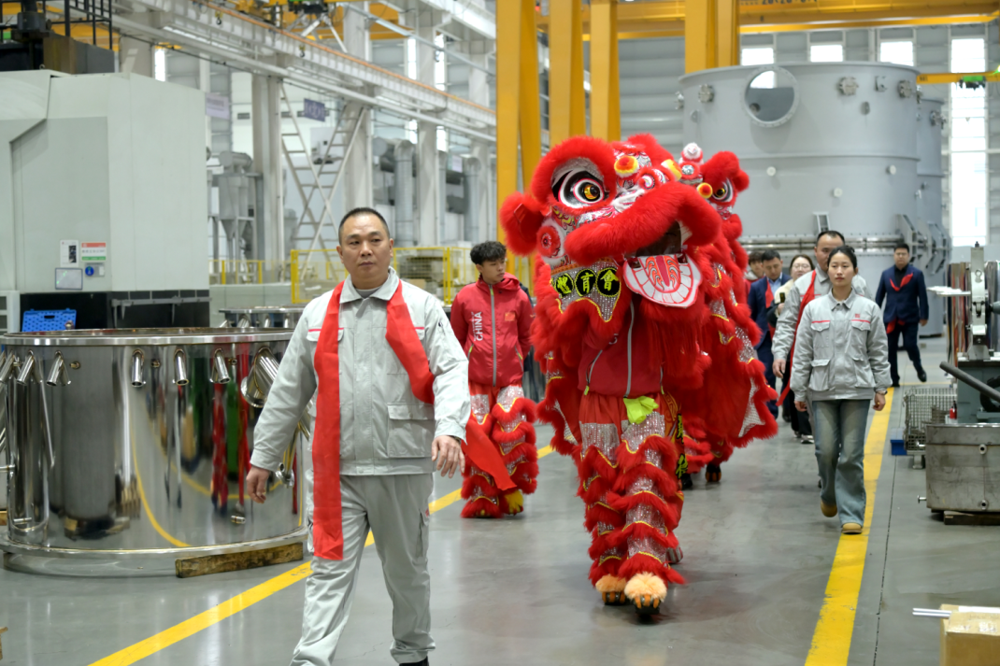

舞狮纳福现场（右滑更多）

**02**

**表彰盛典，荣光共证**

庆典中，红运机械总经理吕柏良作了重要讲话，全面总结了 2025 年公司在国内外市场拓展、技术创新、保生产、保品质、保交付取得的成绩，充分肯定了红运人在过去一年取得的的成绩与付出，并对大家致以诚挚的感谢。

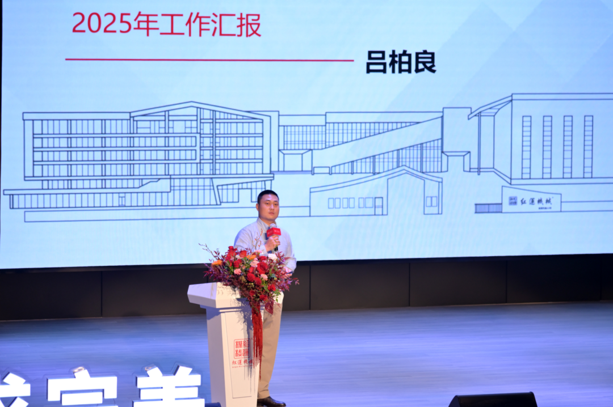

红运机械总经理吕柏良

红运机械始终秉承
**“追求完美，做到极致“的价值观，聚焦管理、品质、交付，不断优化管理体系、提升运行效能，打通部门壁垒、明晰权责，推动公司高效运转。2026年公司将实施绩效激励政策、实现个人与公司利益的双向奔赴，强化人才培养与队伍建设，做到让有为者有位、让实干者出彩。坚持在开拓进取、攻坚克难，巩固传统产业优势的同时，**
**积极布局新兴赛道，抢抓智能制造、绿色能源发展机遇，在高质量发展的浪潮中行稳致远。**

回望2025年，公司涌现出了大批肯担当、能实干，业绩突出的优秀部门与个人。庆典现场，公司为杰出部门、开拓先锋、创新之星等先进部门和个人隆重颁奖，以表彰先进、树立标杆，激励全体红运人再创佳绩。

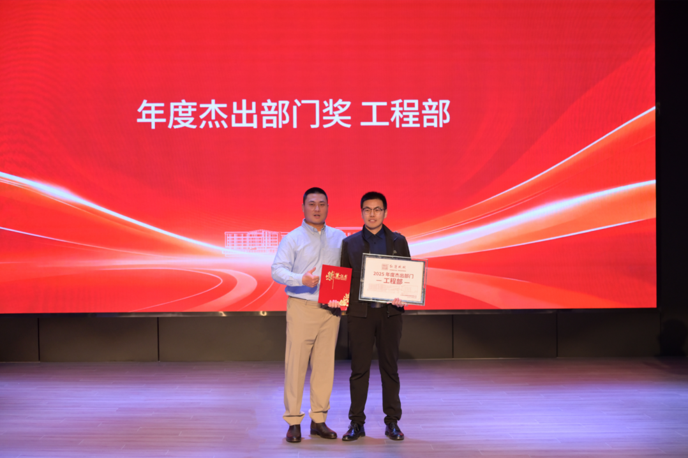

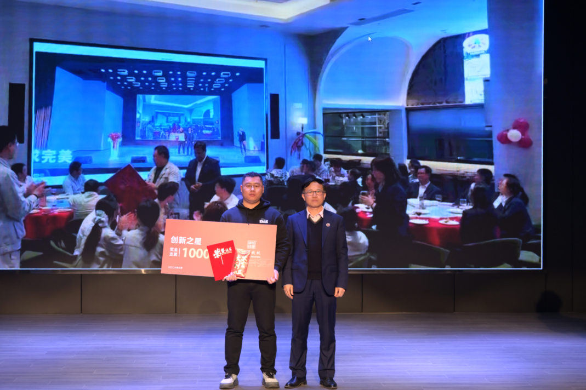

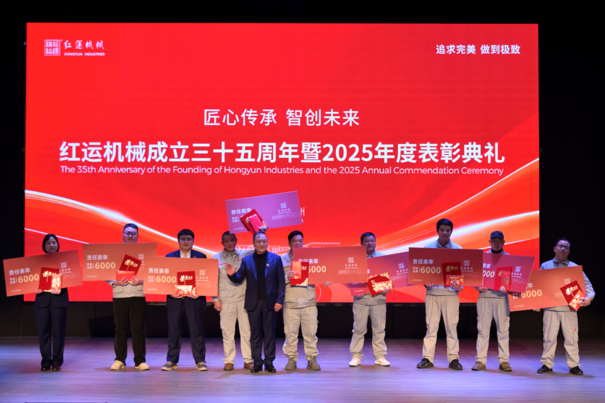

表彰合影（右滑更多）

红运机械董事长吕范乐为全体员工送上祝福与寄语，希望大家始终保持一颗
**平常心，知足常乐，踏实做事；**
**用心感受工作与生活带来的幸福感，以热爱奔赴岗位；**
**牢记肩上的责任感，勇于担当；坚守**
**利他原则，心怀团队，共同成就更好的红运。**

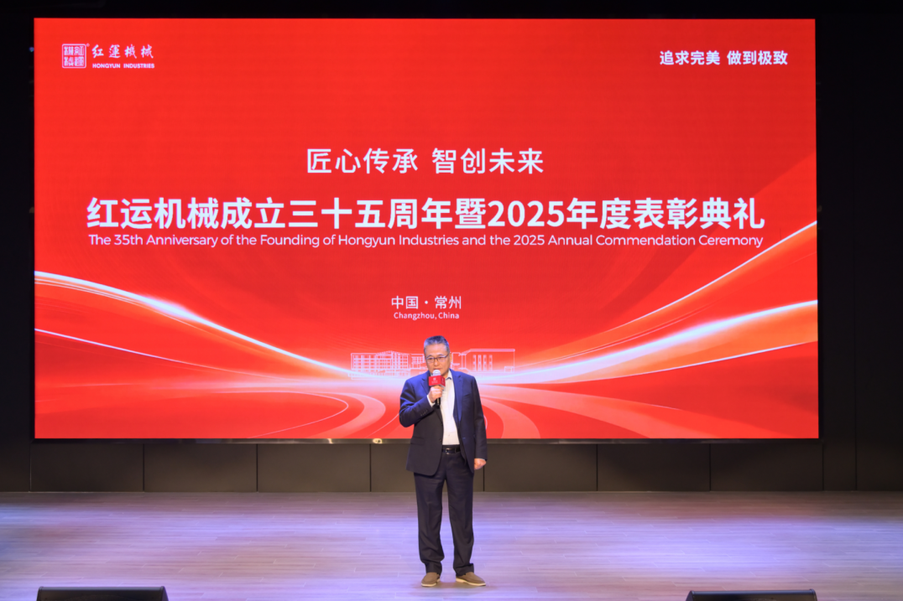

红运机械董事长吕范乐发言

除了各类奖项的颁发，舞台上文艺演出轮番上演，舞台下掌声雷动，充分展现了红运家人昂扬向上的精神风貌。

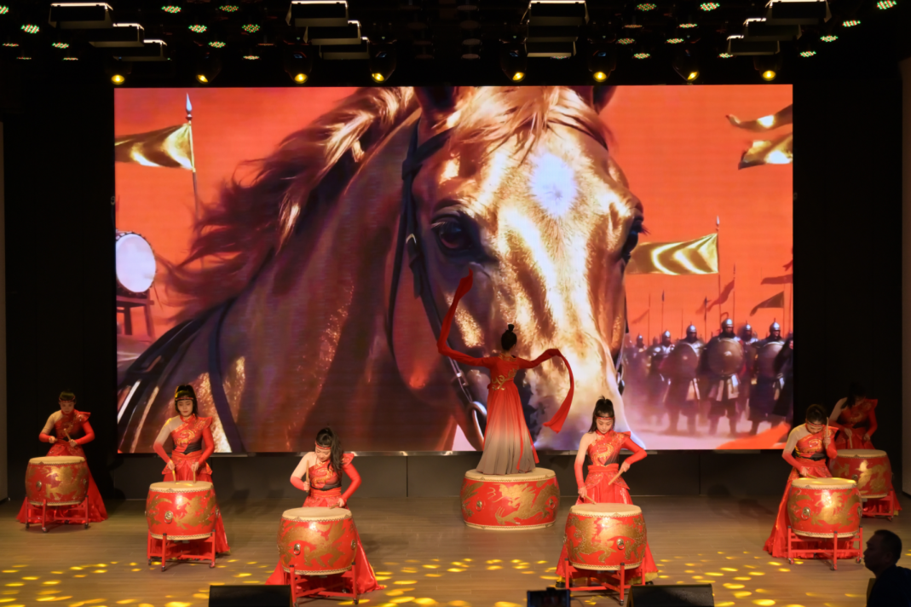

现场演出：中华鼓魂（右滑更多）

《你的答案》

歌曲表演《梦驼铃》《红梅赞》

《最亲的人》

魔术表演

全场合影

**03**

**欢聚时刻，同心同行**

盛宴相伴，情谊绵长。典礼尾声，全体同仁举杯共庆，在欢声笑语中分享年度喜悦，共话美好未来。温馨融洽的氛围里，凝聚着并肩作战的深厚情谊，承载着对红运机械明天的美好期许。

初心如磐向未来，匠心筑梦谱新篇。2026年，红运机械将坚守匠心、
**深耕高端装备制造领域，致力成为全球混合设备服务领域的标杆企业。**

感恩全体员工同行，祝全体家人及各界朋友元宵喜乐、阖家幸福、万事顺意、马年大吉！

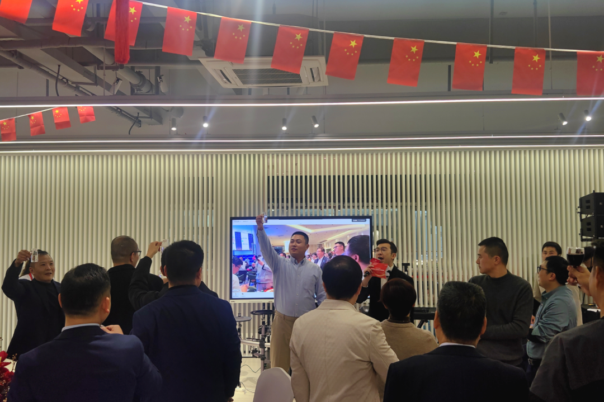

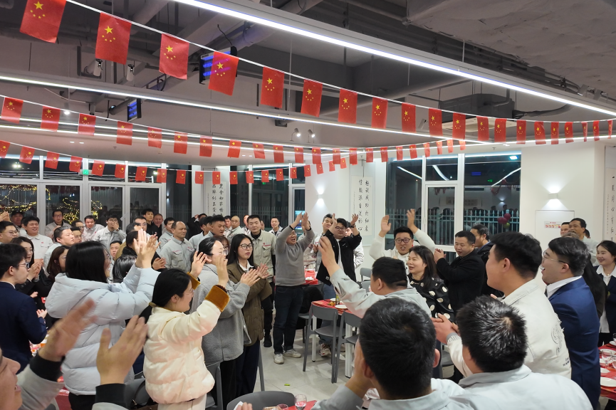

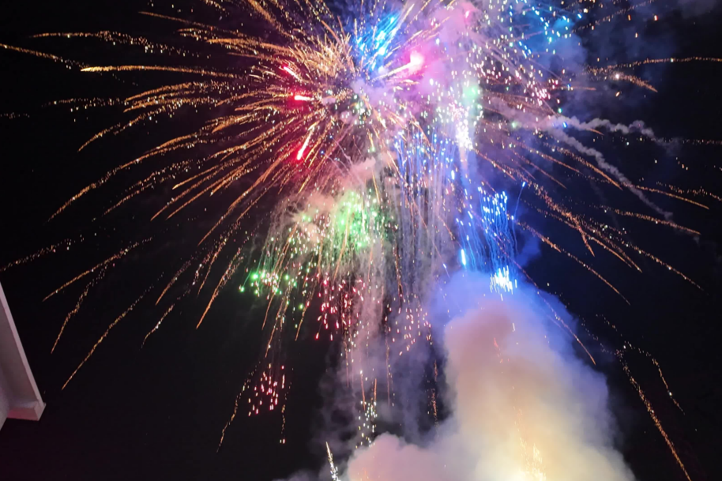

欢聚时刻（右滑更多）

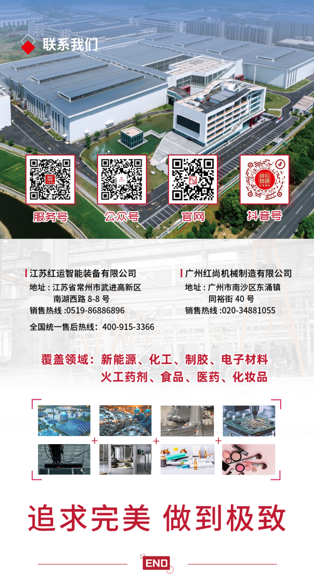
