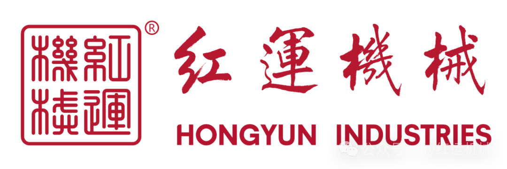
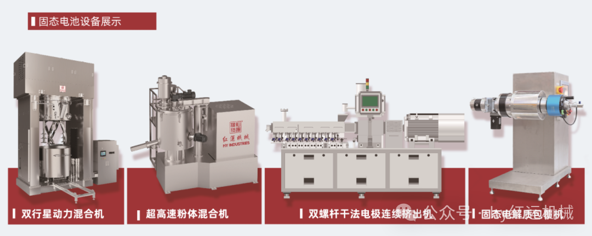
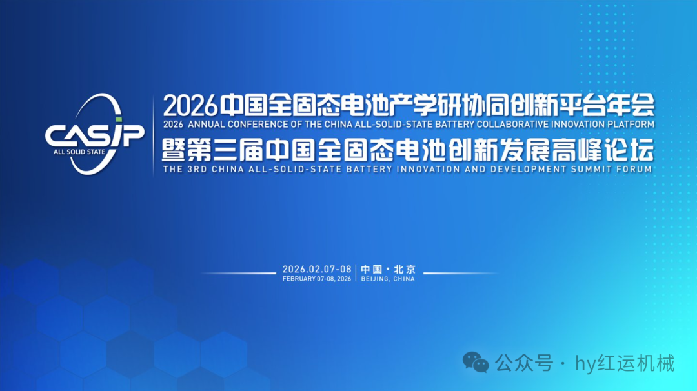
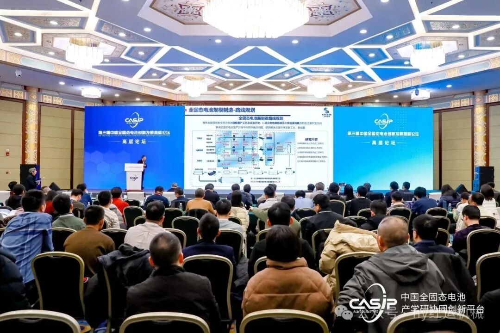
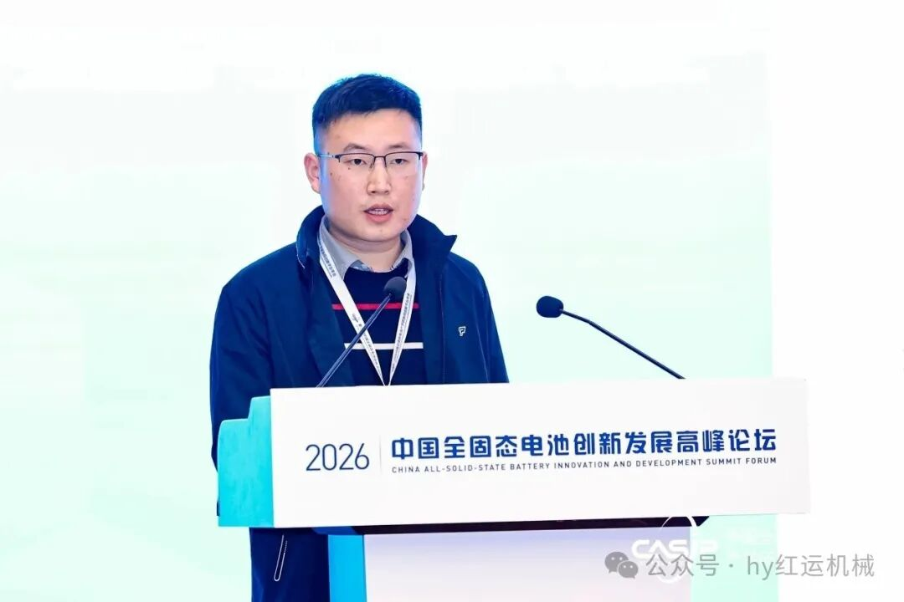
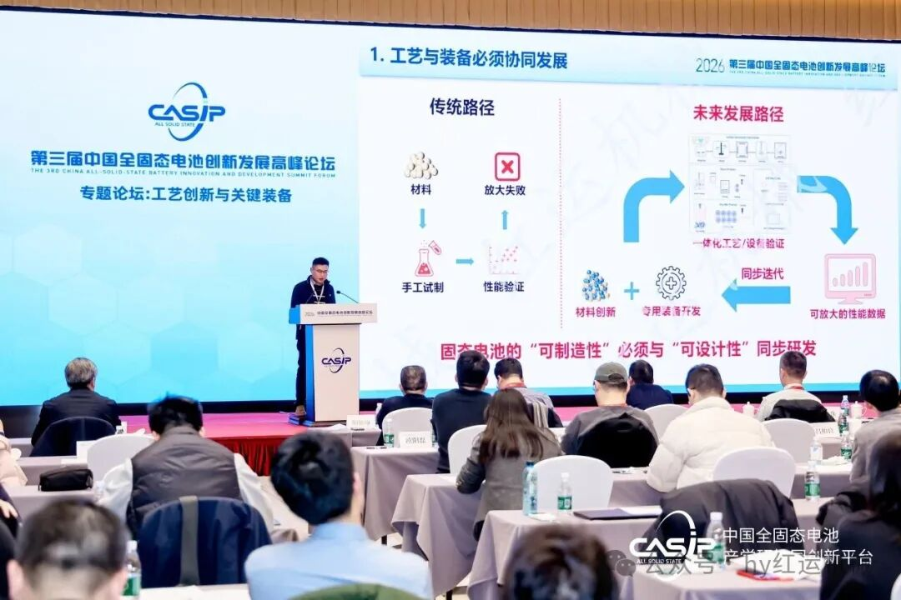
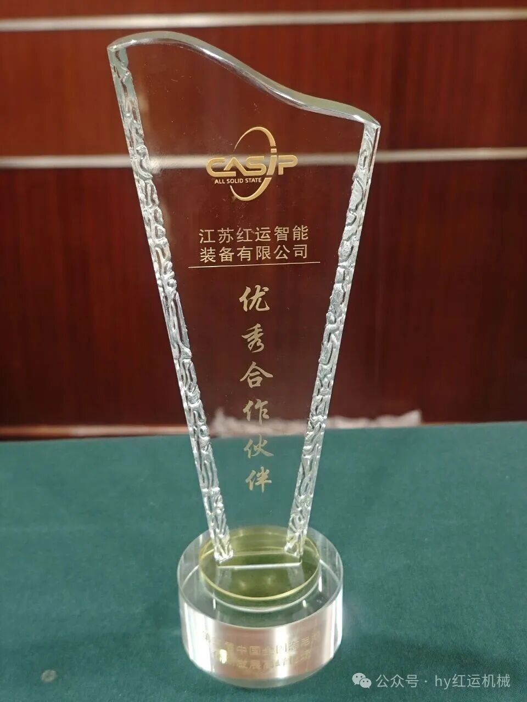
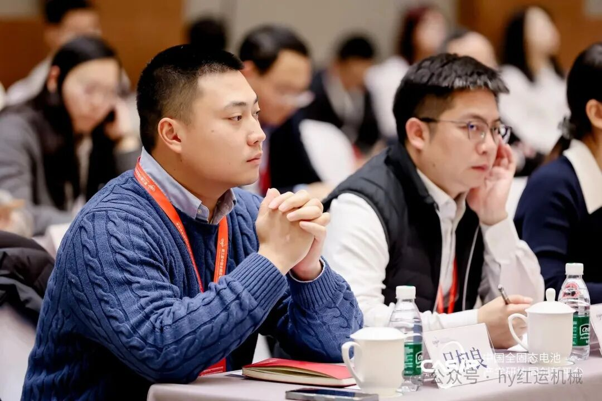
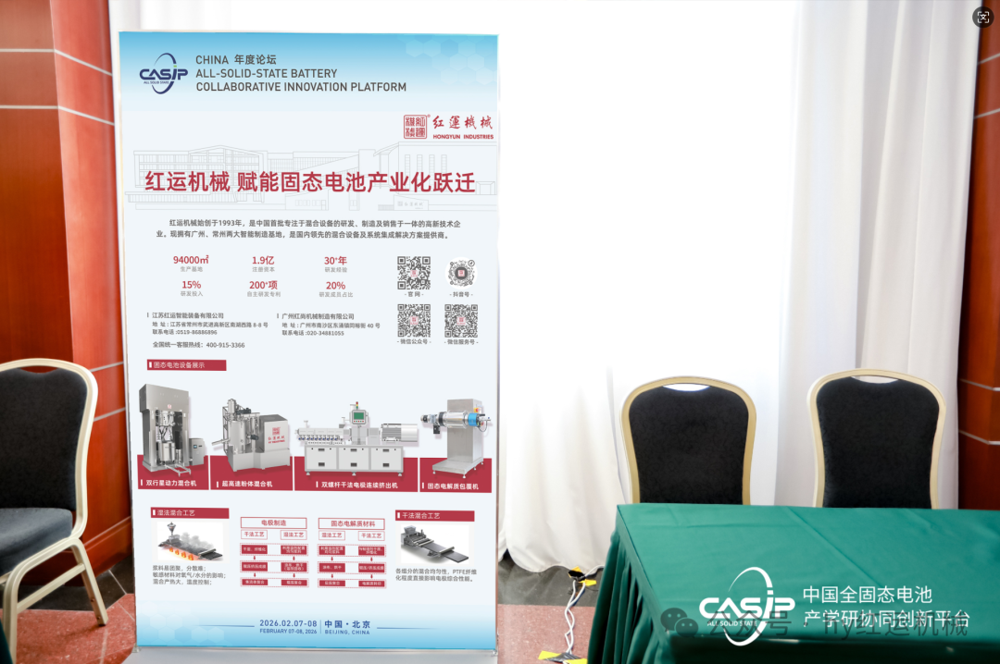
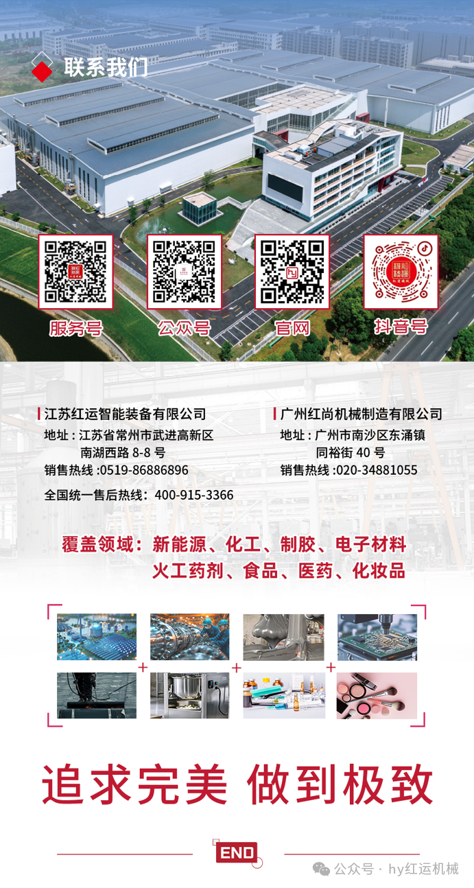

# 红运机械亮相固态电池顶级盛会 分享固态电池量产前沿工艺

> **作者**: 红运机械 | **发布时间**: 2026年2月9日 14:19

---

**红运机械亮相全国固态电池**

**产学协同创新平台年会**

**分享固态电池量产前沿工艺**

2月7日至8日，2026年中国全固态电池产学研协同创新平台年会在北京召开。会议汇聚政产学研各界力量，聚焦全固态电池研发进展、共性战略研判、共性关键技术问题展开深度研讨。

作为国内固态电池工艺装备领域的代表企业，红运机械总经理吕柏良受邀参会，固态电池工艺总工程师吴博在“工艺创新与关键装备”专题论坛上发表主题演讲，分享固态电池量产前沿工艺。

2026中国全固态电池产学研协同创新平台年会

在本次年会上，中国科学院院士、清华大学教授、平台理事长欧阳明高主持，围绕全固态电池研发最新进展与挑战，中国一汽、东风汽车、长安汽车、比亚迪、广汽埃安、奇瑞汽车、卫蓝新能源的代表作技术分享，与会的多位院士学者及技术专家深度剖析科学问题、工程问题、工艺问题，进一步凝聚共识，坚定信心，探讨突破方向。会议传递出一个明确信号：2026年已成为中国全固态电池从实验室走向工程验证的关键分水岭。

**年会现场**

**PART.01**

**前沿技术分享**

红运机械作为本次会议专题论坛中量产装备制造企业代表，分享了固态电池制造中面临的材料体系与液态电池制造工艺之间存在的鸿沟的及最新的解决方案。其中，界面工程是决定电池性能与寿命的关键。固态电解质与电极材料之间“固-固接触”带来的高界面阻抗，成为制约固态电池性能的主要瓶颈。

**红运机械固态工艺总工吴博**

面对这些挑战，红运机械分享了在固态电池专用装备领域的创新成果。公司已开发出具有自主知识产权的固态电池材料设备包覆机，以及适用于硫化物系、氧化物系、聚合物系等各种物系的干法高速粉体混合机、干法双螺杆挤出机等多种核心设备。

“实验数据表明，红运的全固态电池工艺在固态电解质材料混合的均匀性、PTFE纤维化以及在加工过程中对敏感材料、水分、氧气、温度等多种要求都可以达到精准控制。”红运机械固态工艺总工强调。

**PART.02**

**研发协同**

值得一提的是，红运机械的创新装备研发并非闭门造车，而是深度融入中国全固态电池产学研协同创新平台构建的协同创新生态。凭借在固态电池工艺装备领域的突出贡献与深度协同表现，红运机械在本次年会上荣获“优秀合作伙伴”称号，这份荣誉既是对公司技术实力与合作诚意的高度认可，也是对其助力固态电池产业化发展努力的充分肯定。

**优秀合作伙伴奖杯**

通过加强与平台成员单位的合作，打通从材料端到终端产品上下游，以量产化思维优化生产工艺、提升生产节拍，降低固态电池生产成本，为固态电池量产化落地提供更优的解决方案。

在分享中吕总也对固态电池产业化趋势进行了预言：“我们认为，2026-2028年是固态电池从工程验证走向小批量装车的关键窗口期。”他预测，随着材料体系的逐步成熟和工艺装备的不断优化，全固态电池的生产成本将在未来三年内大幅下降。

**红运机械总经理吕柏良**

**PART.03**

**多层次交流**

会议期间，红运机械的展台前始终围满了前来咨询的专业观众。参会的各电池企业的研发负责人对红运机械固态电池设备核心设备细节进行了仔细询问。随着会议闭幕，红运机械的技术团队已收到多家科研机构和企业的后续交流邀请。

**红运机械展台**

中国工程院院士陈立泉在大会致辞中强调：“全固态电池的产业化是一场系统性的创新，需要材料、工艺、装备全链条的协同突破。”

红运机械正以30多年在工艺装备领域的专业积累，为这场电池技术的革命贡献自己的力量。

