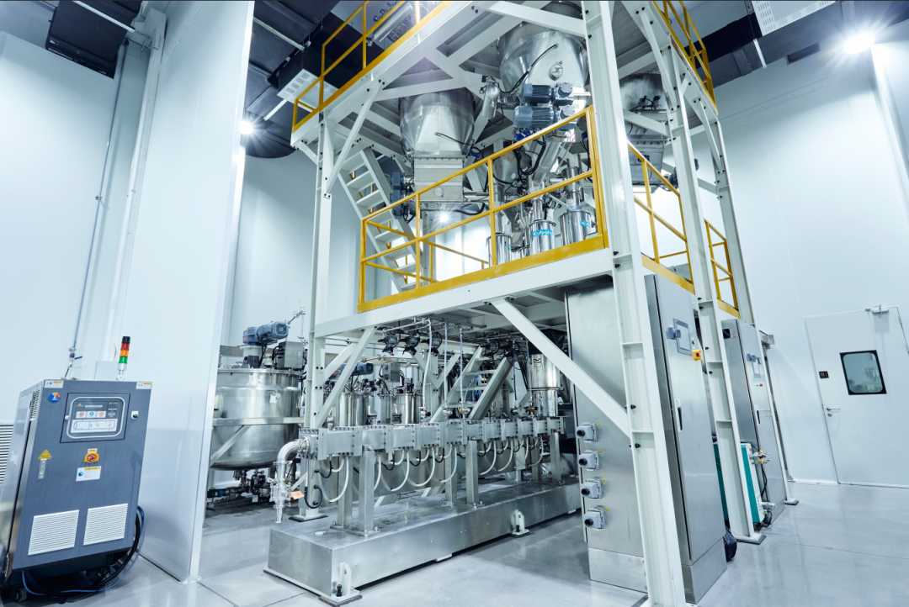
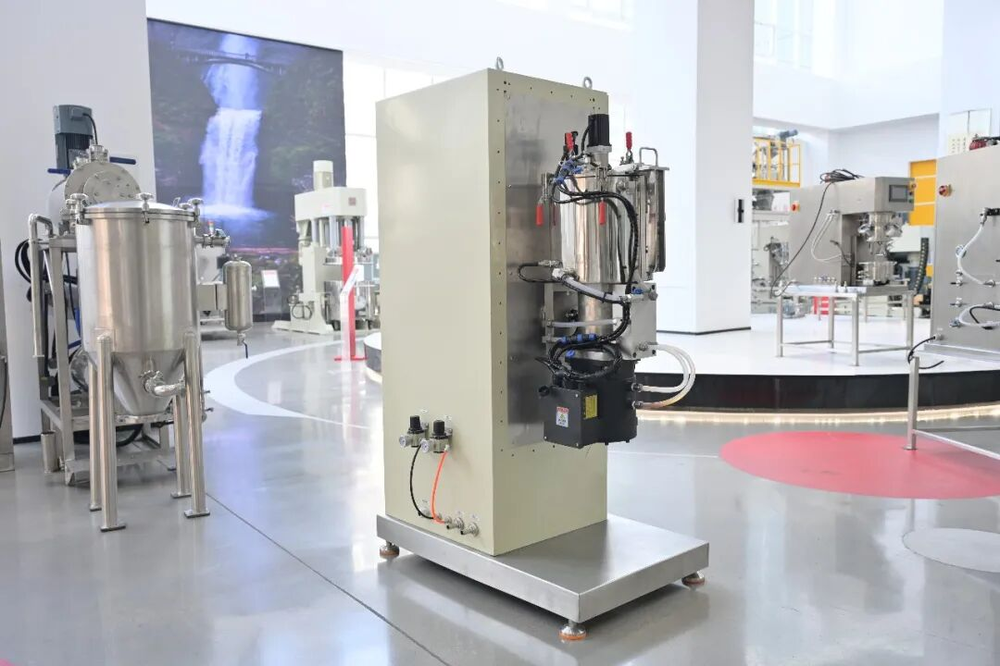
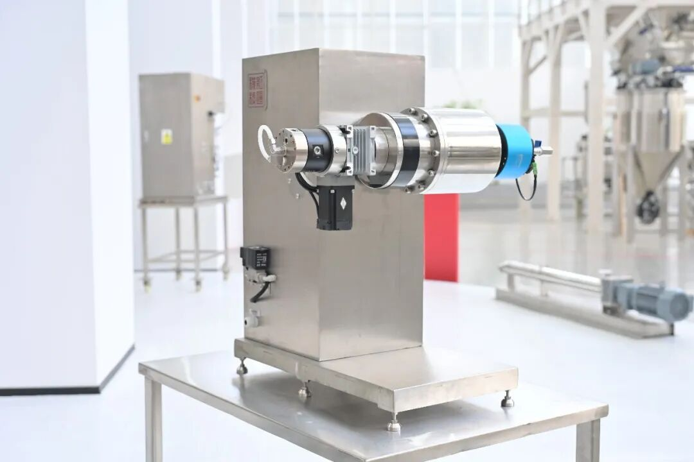

# 聚力固态未来，共赴产业跃迁——红运机械 受邀出席2026中国全固态电池产学研协同创新平台年会暨第三届高峰论坛

> **作者**: 红运机械 | **发布时间**: 2026年1月8日 16:13

---

日前，作为固态电池产线研发先锋的红运机械受邀出席于2026年2月7日至8日在北京隆重举办的“2026中国全固态电池产学研协同创新平台年会暨第三届中国全固态电池创新发展高峰论坛”。本届年会是由欧阳明高院士发起的中国全固态电池产学研协同创新平台主办，是我国固态电池领域一年一度的高级别、权威性行业盛会。

本届年会主题 “聚能 跃迁”

固态电池作为下一代动力电池技术的核心方向，其发展关乎国家能源安全与新能源汽车产业国际竞争力。本次年会，旨在汇聚政府、产业、学术、科研及资本多方力量，深入研判技术趋势，破解产业化难题，加速创新链与产业链的深度融合与价值跃升。

工厂生产设备实景图

红运双螺杆干法电极连续挤出系统

红运机械将会以固态电池高端制造装备为主题进行专项汇报，向与会各方展示一年来在固态电池装备领域最新的研发进度及成果。红运机械已经探索出湿法电极和干法电极两种工艺路线，且完成了核心设备的自主开发工作。两种工艺路线能够满足目前主流的聚合物、氧化物和硫化物系所有固态电池制造方案，为客户提供全固态/半固态电池的量产装备解决方案。

实验级或工业级搅拌装置设备图

红运高速粉体混合机

为固态电池关键高端装备制造的重要参与方，红运机械始终关注并积极投入固态电池技术的创新与发展。此次受邀参会，既是对我单位在该领域所做工作和行业地位的认可，也为我们提供了与国家级智库、顶尖科研力量及产业同仁深度交流、学习互鉴的宝贵机会。我单位代表将积极参与相关论坛与交流活动，分享我们在固态电池量产先进装备方面的实践与思考，并寻求更广泛的产学研合作机遇，共同为推动我国全固态电池技术突破与产业健康发展贡献力量。

机械设备近景实拍

红运包覆机

迈向2026，固态电池技术正处于从实验室走向规模化应用的关键跃迁期。红运机械期待与各界同仁在北京相聚，共同见证并参与这一能源存储革命的里程碑盛会，聚力突破，携手迎接新一轮电池技术竞争，为中国乃至全球的新能源产业转型注入强劲动能。
